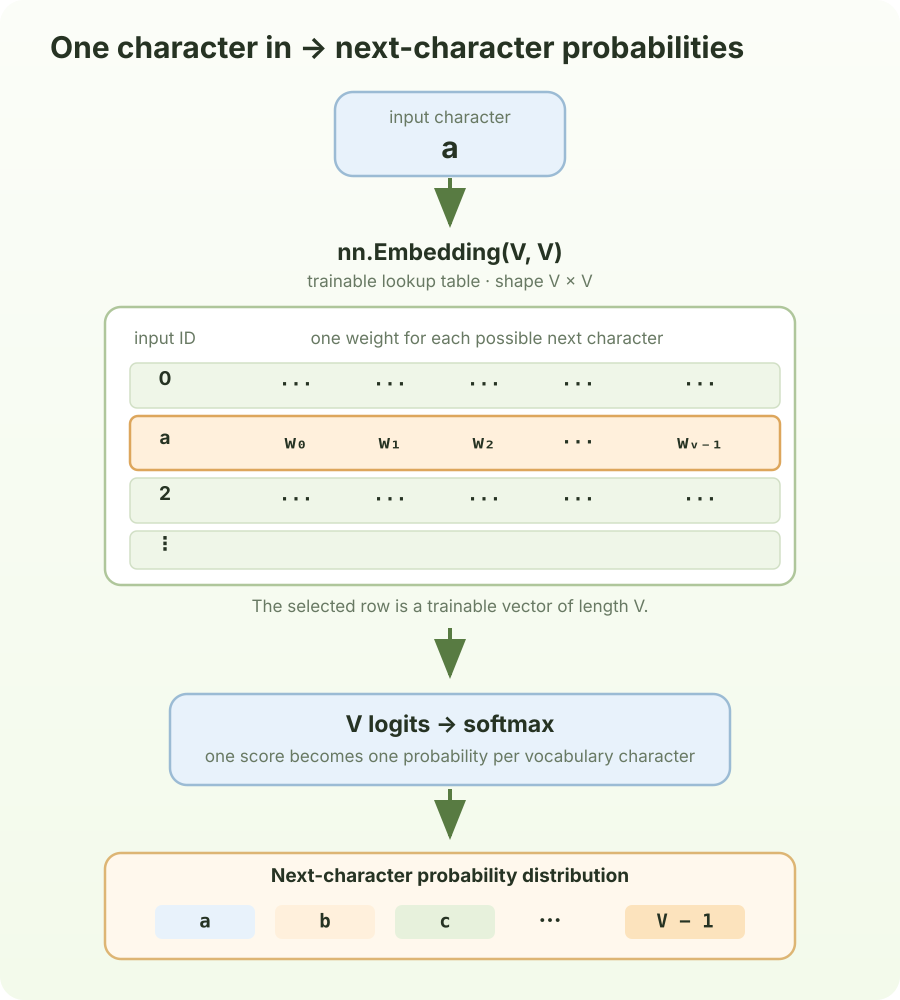

# Chapter 2: The Bigram Baseline

Before adding attention, establish a model that only asks: “given this token, what token tends to follow it?”

## 1. Bigram model

The Bigram model uses a trainable lookup table with shape `(vocab_size, vocab_size)`. Each character ID selects one row: a fixed-length vector with one score (a logit) for every possible next character. In `forward`, lookup returns one such vector for each input position. Softmax turns those scores into a probability distribution over the vocabulary; during training, cross-entropy compares the scores with the actual next-character targets.



```python
import torch
import torch.nn as nn
from torch.nn import functional as F
torch.manual_seed(1337)

class BigramLanguageModel(nn.Module):

    def __init__(self, vocab_size):
        super().__init__()
        self.token_embedding_table = nn.Embedding(vocab_size, vocab_size)

    def forward(self, idx, targets = None):
        logits = self.token_embedding_table(idx) # (B,T,C)

        if targets is None:
            loss = None
        else:
            B, T, C = logits.shape
            logits = logits.view(B * T, C)
            targets = targets.view(B * T)
            loss = F.cross_entropy(logits, targets)

        return logits, loss

model = BigramLanguageModel(vocab_size)
logits, loss = model(xb, yb)
print(logits.shape)
print(loss)
```

```text
torch.Size([32, 62])
tensor(4.7232, grad_fn=<NllLossBackward0>)
```

## 2. Train Bigram model

```python
# create a PyTorch optimizer
optimizer = torch.optim.AdamW(model.parameters(), lr=1e-4)

batch_size = 32
for steps in range(10000):

    # sample a batch of data
    xb, yb = get_batch('train')

    # evaluate the loss
    logits, loss = model(xb, yb)
    optimizer.zero_grad(set_to_none=True)
    loss.backward()
    optimizer.step()

print(loss.item())
```

```text
2.794534921646118
```

## 3. Next token prediction

Generation uses the trained model to produce one token at a time. At each step, the model looks up the logits for the current final character, converts them into probabilities with softmax, samples the next character, and appends it to the sequence. The new character becomes the input for the following step. Because this is a Bigram model, each prediction depends only on the current character—not on the earlier characters in the sequence.

```python
class BigramLanguageModel(nn.Module):

    def __init__(self, vocab_size):
        super().__init__()
        self.token_embedding_table = nn.Embedding(vocab_size, vocab_size)

    def forward(self, idx, targets = None):
        logits = self.token_embedding_table(idx) # (B,T,C)

        if targets is None:
            loss = None
        else:
            B, T, C = logits.shape
            logits = logits.view(B * T, C)
            targets = targets.view(B * T)
            loss = F.cross_entropy(logits, targets)

        return logits, loss

    def generate(self, idx, max_new_tokens):
        # idx is (B, T) array of indices in the current context
        for _ in range(max_new_tokens):
            # get the predictions
            logits, loss = self(idx)
            # focus only on the last time step
            logits = logits[:, -1, :] # (B, C)
            # apply softmax to get probabilities
            probs = F.softmax(logits, dim=-1) # (B, C)
            # sample from the distribution
            idx_next = torch.multinomial(probs, num_samples=1) # (B, 1)
            # append sampled index to the running sequence
            idx = torch.cat((idx, idx_next), dim=1) # (B, T+1)
        return idx
```

After training, start with a one-token prompt and repeat that predict-and-append loop for as many new tokens as you want to generate:

```python
def predict(token_number):
    inputs = torch.zeros((1, 1), dtype=torch.long)
    outputs = model.generate(inputs, max_new_tokens=token_number)
    decode_text = decode(outputs[0].tolist())
    print(decode_text)

predict(100)
```

```text
He tas br be." nd l lfuth sthe im? uthan abutht ayo hetoutaim he I t. a ont lis touted m ckits wa ba
```
