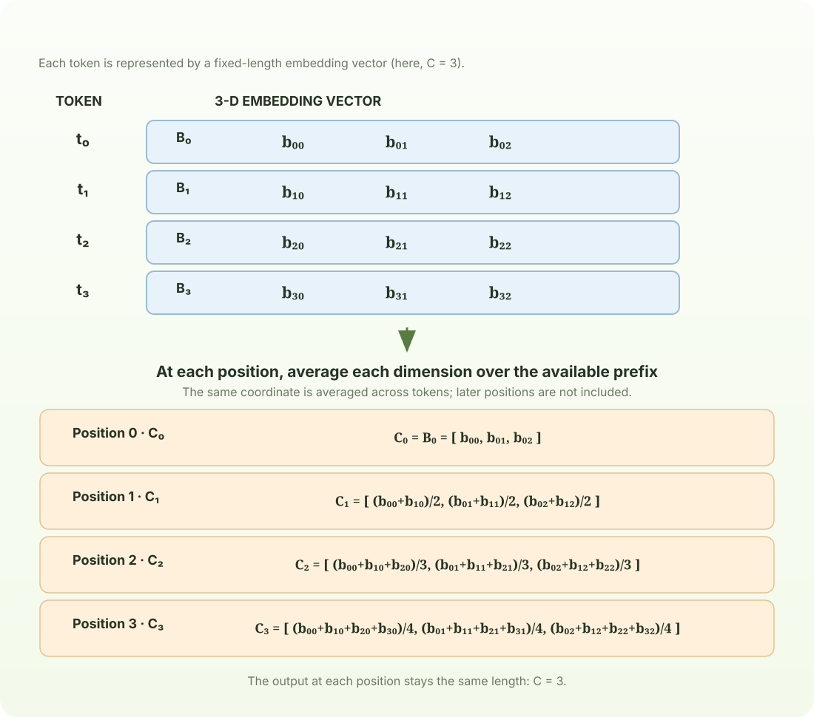

# Chapter 3: Efficient Context Mixing

The Bigram model ignores all earlier context. A first improvement is to let each token talk to each other and exchange information.

## 1. Averaging previous context

At each position, build a context-aware vector by averaging the current vector with all vectors before it. The first position averages only itself; each later position includes one more vector. This simple operation lets information flow from the past, while never using future positions.



```python
torch.manual_seed(42)

B,T,C = 1,4,3 # batch, time, channels

a = torch.tril(torch.ones(T, T))
a = a / torch.sum(a, 1, keepdim=True)

b = torch.randn(B,T,C)
c = a @ b
print('a=')
print(a)
print('--')
print('b=')
print(b)
print('--')
print('c=')
print(c)
```

```text
a=
tensor([[1.0000, 0.0000, 0.0000, 0.0000],
        [0.5000, 0.5000, 0.0000, 0.0000],
        [0.3333, 0.3333, 0.3333, 0.0000],
        [0.2500, 0.2500, 0.2500, 0.2500]])
--
b=
tensor([[[ 0.3367,  0.1288,  0.2345],
         [ 0.2303, -1.1229, -0.1863],
         [ 2.2082, -0.6380,  0.4617],
         [ 0.2674,  0.5349,  0.8094]]])
--
c=
tensor([[[ 0.3367,  0.1288,  0.2345],
         [ 0.2835, -0.4970,  0.0241],
         [ 0.9251, -0.5440,  0.1699],
         [ 0.7606, -0.2743,  0.3298]]])
```

## 2. A trick using Softmax

Softmax turns scores into weights that add up to one. Set future-position scores to negative infinity, and they receive zero weight. The remaining scores here are all zero, so Softmax gives every available position an equal share—producing the same running average as above. Attention uses the same masking idea, but can assign different scores to different positions.

```python
tril = torch.tril(torch.ones(T, T))
weights = torch.zeros((T,T))
weights = weights.masked_fill(tril == 0, float('-inf'))
print(weights)
weights = F.softmax(weights, dim=-1)
print(weights)
```

```text
tensor([[0., -inf, -inf, -inf],
        [0., 0., -inf, -inf],
        [0., 0., 0., -inf],
        [0., 0., 0., 0.]])
tensor([[1.0000, 0.0000, 0.0000, 0.0000],
        [0.5000, 0.5000, 0.0000, 0.0000],
        [0.3333, 0.3333, 0.3333, 0.0000],
        [0.2500, 0.2500, 0.2500, 0.2500]])
```
