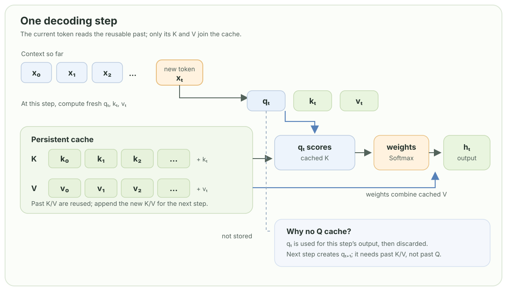

# Chapter 4: Self-Attention

Self-attention lets every token decide which earlier tokens are relevant. Each position produces a **query** (what am I looking for), a **key** (what do I contain), and a **value** (what information should I send).

## 1. Scaled dot-product attention

For queries `Q`, keys `K`, and values `V`, the core operation is:

$$
\operatorname{Attention}(Q,K,V)=\operatorname{softmax}\left(\frac{QK^T}{\sqrt{d_k}}\right)V
$$

The lower-triangular mask sets future affinities to negative infinity before softmax. The scale by `√d_k` keeps logits in a useful range at initialization.

```python
B,T,C = 2, 4, 6 # batch, time, channels
x = torch.randn(B,T,C)

head_size = 16
key = nn.Linear(C, head_size, bias=False)
query = nn.Linear(C, head_size, bias=False)
value = nn.Linear(C, head_size, bias=False)
k = key(x)   # (B, T, 16)
q = query(x) # (B, T, 16)
wei =  q @ k.transpose(-2, -1) # (B, T, 16) @ (B, 16, T) ---> (B, T, T)

tril = torch.tril(torch.ones(T, T))
wei = wei.masked_fill(tril == 0, float('-inf'))
wei = F.softmax(wei, dim=-1)
print("wei[0]=")
print(wei)

v = value(x)
out = wei @ v

print("out shape=")
print(out.shape)
```


Unlike the uniform weights in the previous section, these attention weights depend on the input. The trainable query and key projections determine each query–key score; Softmax turns those scores into a distribution over the visible context. During training, gradients from the prediction loss update the projections, allowing the model to learn which earlier positions are useful for each input. The weights are therefore computed dynamically, not stored as one fixed set of values. The causal mask still gives future positions exactly zero weight.

```text
wei=
tensor([[[1.0000, 0.0000, 0.0000, 0.0000],
         [0.8588, 0.1412, 0.0000, 0.0000],
         [0.5144, 0.2423, 0.2433, 0.0000],
         [0.0864, 0.6992, 0.1418, 0.0726]],

        [[1.0000, 0.0000, 0.0000, 0.0000],
         [0.4835, 0.5165, 0.0000, 0.0000],
         [0.2309, 0.3487, 0.4203, 0.0000],
         [0.1741, 0.2136, 0.2453, 0.3670]]], grad_fn=<SoftmaxBackward0>)
out shape=
torch.Size([2, 4, 16])
```

## 2. Keep variance unit

```python
k = torch.randn(B, T, head_size)
q = torch.randn(B, T, head_size)
wei1 = q @ k.transpose(-2, -1)
wei2 = q @ k.transpose(-2, -1) * head_size**-0.5

prob1 = torch.softmax(torch.tensor([0.1, -0.2, 0.3, -0.2, 0.5]), dim=-1)
prob2 = torch.softmax(torch.tensor([0.1, -0.2, 0.3, -0.2, 0.5]) * 6, dim=-1)

print("k var: ", k.var())
print("q var: ", q.var())
print("wei1 var: ", wei1.var())
print("wei2 var: ", wei2.var())

print("prob1: ", prob1)
print("prob2: ", prob2)
```

```text
k var:  tensor(0.9317)
q var:  tensor(0.8089)
wei1 var:  tensor(10.9622)
wei2 var:  tensor(0.6851)

prob1:  tensor([0.1925, 0.1426, 0.2351, 0.1426, 0.2872])
prob2:  tensor([0.0638, 0.0105, 0.2118, 0.0105, 0.7033])
```

Each entry of `q` and `k` starts with roughly zero mean and unit variance. A dot product adds `head_size` pairwise products, so its variance grows roughly in proportion to `head_size` (and its typical magnitude grows like `√head_size`). The measured `wei1` variance is therefore much larger than the input variances. Dividing by `√head_size`—the `head_size**-0.5` in `wei2`—brings the score variance back to roughly the same scale as the inputs, even as the head gets wider.

This matters because Softmax exponentiates the scores: if their magnitudes grow, small differences can turn into a distribution dominated by one position, as the `prob2` example illustrates. Such saturated probabilities make it harder for gradients to adjust the attention weights. Scaling keeps the logits in a stable range so attention can learn useful distinctions without becoming sharply peaked just because `head_size` is large. The small gap between the measured `wei2` variance and 1 is expected from a finite random sample.

## 3. KV cache

Autoregressive generation produces one new token at a time. Without a cache, the model would run the whole growing prefix through every Transformer layer again at each step. A **KV cache** keeps the keys and values already computed at each layer, so the next token can reuse them.

At a new decoding step, the current token produces a fresh query, key, and value. Its query is compared with the cached keys (plus the new key) to get attention weights; those weights combine the cached values (plus the new value) into the current output. The new key and value are then appended to the cache for the next step.

There is no need to keep old queries. A query is used only to calculate attention for the position that produced it. The next position creates its own query and uses that to read the available keys and values. Past queries are not inputs to later attention calculations, so retaining them would use memory without helping generation.


