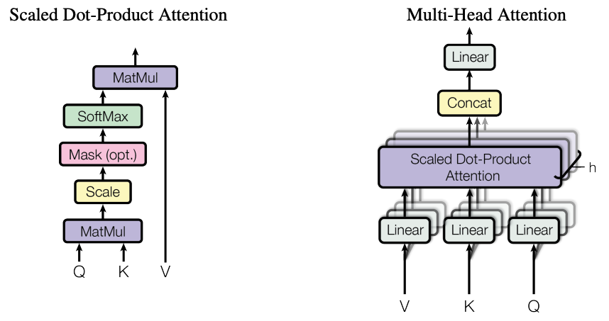
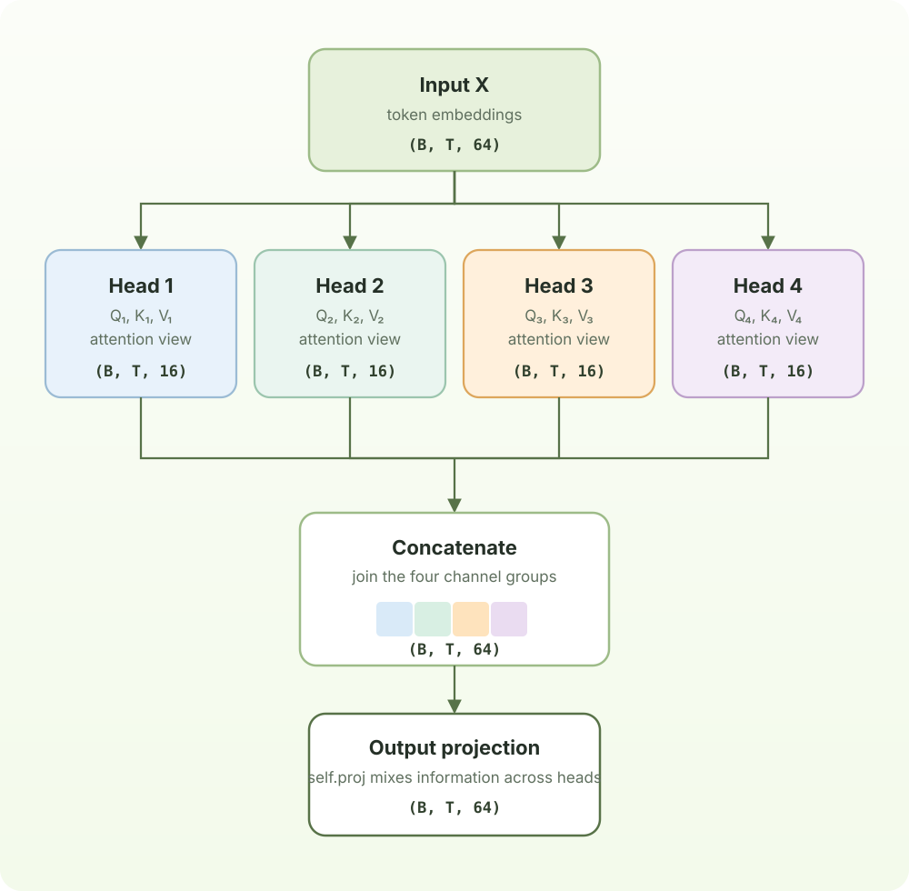

# Chapter 5: Multi-Head Attention

One attention head produces one attention matrix. At every token position, that matrix gives a single weighted mixture of the earlier value vectors. A single head can learn a useful communication pattern, but every kind of relationship must compete for the same query, key, and value representation.

Multi-head attention gives the same input several independent views. Each head has its own learned query, key, and value projections:

$$
\operatorname{head}_h(X) = \operatorname{Attention}(XW_Q^{(h)}, XW_K^{(h)}, XW_V^{(h)})
$$



The heads are not manually assigned roles. During training, one head may become useful for nearby-token patterns while another may focus on a different earlier position or a different feature of the context. The model can therefore consider several relationships at the same token position instead of reducing everything to one set of attention weights.

Their outputs are concatenated and then mixed by an output projection:

$$
\operatorname{MultiHead}(X) = \operatorname{Concat}(\operatorname{head}_1, \ldots, \operatorname{head}_H)W_O
$$

In this implementation, for example, if `n_embd = 64` and **4** heads use `head_size = 16`. Each `Head` turns an input of shape `(B, T, 64)` into `(B, T, 16)`. Concatenating the four results restores `(B, T, 64)`, and `self.proj` learns how information from the heads should be combined before the result continues through the Transformer block.

The following example makes the tensor shapes in that diagram concrete.



```python
class Head(nn.Module):
    """ one head of self-attention """

    def __init__(self, head_size):
        super().__init__()
        self.key = nn.Linear(n_embd, head_size, bias=False)
        self.query = nn.Linear(n_embd, head_size, bias=False)
        self.value = nn.Linear(n_embd, head_size, bias=False)
        self.register_buffer('tril', torch.tril(torch.ones(block_size, block_size)))

        self.dropout = nn.Dropout(dropout)

    def forward(self, x):
        B,T,C = x.shape
        k = self.key(x)   # (B,T,C)
        q = self.query(x) # (B,T,C)
        wei = q @ k.transpose(-2,-1) * C**-0.5 # (B, T, C) @ (B, C, T) -> (B, T, T)
        wei = wei.masked_fill(self.tril[:T, :T] == 0, float('-inf')) # (B, T, T)
        wei = F.softmax(wei, dim=-1) # (B, T, T)
        wei = self.dropout(wei)
        v = self.value(x) # (B,T,C)
        out = wei @ v # (B, T, T) @ (B, T, C) -> (B, T, C)
        return out

class MultiHeadAttention(nn.Module):
    """ multiple heads of self-attention in parallel """

    def __init__(self, num_heads, head_size):
        super().__init__()
        self.heads = nn.ModuleList([Head(head_size) for _ in range(num_heads)])
        self.proj = nn.Linear(n_embd, n_embd)
        self.dropout = nn.Dropout(dropout)

    def forward(self, x):
        out = torch.cat([h(x) for h in self.heads], dim=-1) # on channel dimension
        out = self.dropout(self.proj(out))
        return out
```
