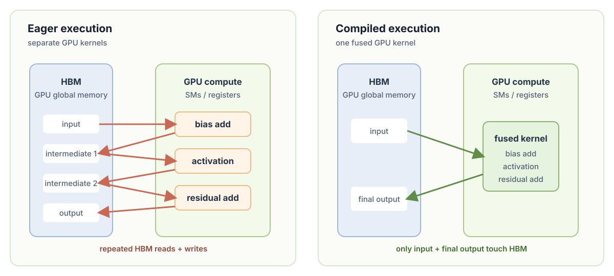

# Chapter 10: Compilation

The earlier experiment used `B=4` and `T=128`, or 512 token predictions per step. Here we increase that to `B=16` and `T=1024`: 16,384 predictions per step, 32× more work for each optimizer update. A larger batch and context window give the GPU enough parallel work to use its Tensor Cores more efficiently, though the longer context also makes attention substantially more memory- and compute-intensive.

The line `model = torch.compile(model)` asks PyTorch to capture compilable regions of the model and generate optimized code for later calls. In this experiment it is layered on top of TF32 and bfloat16 autocast: those choose numerical formats, while compilation reduces framework overhead and can combine compatible operations. The first compiled step includes the one-time compilation cost and should not be used as a throughput measurement. See the [PyTorch `torch.compile` tutorial](https://docs.pytorch.org/tutorials/intermediate/torch_compile_full_example.html) for the general behavior.

```python
import tiktoken
import torch
import time

device = "cpu"
if torch.cuda.is_available():
    device = "cuda"
elif hasattr(torch.backends, "mps") and torch.backends.mps.is_available():
    device = "mps"
print("using device:", device)

B, T = 16, 1024

torch.manual_seed(42)
if device == "cuda":
    torch.cuda.manual_seed(42)

model = GPT(GPTConfig())
model.eval()
model.to(device)
model = torch.compile(model)

training_loader = DataLoaderLite(B, T)

# for GPUs supporting TF32
torch.set_float32_matmul_precision('high')

optimizer = torch.optim.AdamW(model.parameters(), lr=1e-3)

for i in range(100):
    start = time.time()
    x, y = training_loader.next_batch()
    x = x.to(device)
    y = y.to(device)
    with torch.autocast(device_type=device, dtype=torch.bfloat16):
        logits, loss = model(x, y)
    loss.backward()
    optimizer.step()
    optimizer.zero_grad()
    if device == "cuda":
        torch.cuda.synchronize()
    epoch_time = (time.time() - start) * 1000 # ms
    tokens_per_second = (training_loader.B * training_loader.T) / (epoch_time / 1000)
    if i % 10 == 0:
        print(f"step {i}, loss: {loss.item()}, epoch time: {epoch_time:.2f}ms, token_per_second: {tokens_per_second:.2f}")
```

before
```text
using device: cuda
loaded 338025 tokens
1 epoch = 20 batches
step 0, loss: 10.999393463134766, epoch time: 477.48ms, token_per_second: 34313.78
step 10, loss: 6.684403419494629, epoch time: 140.53ms, token_per_second: 116589.09
step 20, loss: 6.747631072998047, epoch time: 140.61ms, token_per_second: 116524.05
step 30, loss: 6.44896125793457, epoch time: 140.64ms, token_per_second: 116492.45
step 40, loss: 6.5381574630737305, epoch time: 140.48ms, token_per_second: 116627.08
step 50, loss: 6.387644290924072, epoch time: 140.63ms, token_per_second: 116503.51
step 60, loss: 6.405113220214844, epoch time: 140.67ms, token_per_second: 116473.69
step 70, loss: 6.126688003540039, epoch time: 141.44ms, token_per_second: 115838.35
step 80, loss: 6.235164642333984, epoch time: 141.46ms, token_per_second: 115819.80
step 90, loss: 6.016355037689209, epoch time: 141.59ms, token_per_second: 115712.34
```

after
```text
using device: cuda
loaded 338025 tokens
1 epoch = 20 batches
step 0, loss: 10.999507904052734, epoch time: 26101.93ms, token_per_second: 627.69
step 10, loss: 6.684609413146973, epoch time: 90.84ms, token_per_second: 180366.55
step 20, loss: 6.7426605224609375, epoch time: 90.79ms, token_per_second: 180454.65
step 30, loss: 6.446186065673828, epoch time: 91.26ms, token_per_second: 179526.41
step 40, loss: 6.540253639221191, epoch time: 92.08ms, token_per_second: 177937.54
step 50, loss: 6.383149147033691, epoch time: 91.39ms, token_per_second: 179279.11
step 60, loss: 6.407015800476074, epoch time: 91.15ms, token_per_second: 179743.82
step 70, loss: 6.131112098693848, epoch time: 91.81ms, token_per_second: 178461.55
step 80, loss: 6.2237548828125, epoch time: 91.17ms, token_per_second: 179706.21
step 90, loss: 5.996917724609375, epoch time: 92.02ms, token_per_second: 178041.26
```

After warm-up, the eager version runs at about 116K tokens/s, while the compiled version reaches roughly 180K tokens/s: about a 1.55× speedup for the same training setup. The 26-second first step is expected compilation overhead; the following steps are the relevant steady-state comparison. The two loss curves remain close, which is the required check that the optimization improves speed without materially changing training behavior.

### Why compilation can improve GPU throughput



Many neural-network operations are limited by GPU memory traffic rather than arithmetic. In eager mode, a sequence such as bias add → activation → residual add may launch separate kernels. Each kernel reads its input from GPU global memory (HBM), writes a full intermediate tensor back to HBM, and the next kernel reads that intermediate again. These repeated reads and writes can cost more time than the arithmetic itself.

`torch.compile` can see compatible operations together and fuse them into a smaller number of kernels. A fused kernel can load an activation once, perform several elementwise operations while the values remain in fast registers or on-chip memory, then write only the final result to HBM. This reduces global-memory traffic, avoids kernel-launch overhead, and leaves more effective memory bandwidth for the large matrix multiplications. Compilation does not eliminate the essential reads and writes of attention or matrix multiplication, but removing unnecessary intermediate tensors is often enough to produce a meaningful speedup.
