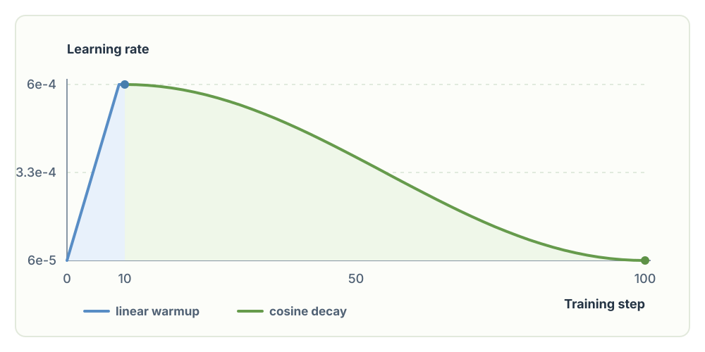

# Chapter 13: Training Hyperparameters and Schedules

## 1. Training parameters

This training recipe follows the optimizer details in the [GPT-3 paper](https://arxiv.org/pdf/2005.14165): Adam with `betas=(0.9, 0.95)` and `eps=1e-8`, a global gradient-norm limit of `1.0`, linear learning-rate warmup, and cosine decay to 10% of the peak rate. Its 125M-parameter model uses a peak learning rate of `6e-4`, which is the value used here.

The paper measures warmup and decay over hundreds of millions and billions of tokens. For this short example, `get_lr()` compresses the same schedule into 10 warmup steps and 100 total steps: the rate rises from `6e-5` to `6e-4`, then decays toward `6e-5`. Before each optimizer update, the loop writes that step's rate into every parameter group, so the `lr=1e-3` supplied when creating `AdamW` is never used for an update. `clip_grad_norm_` limits overly large updates; the printed `norm` is the gradient norm **before** clipping.



```python
import tiktoken
import torch
import time
import math

device = "cpu"
if torch.cuda.is_available():
    device = "cuda"
elif hasattr(torch.backends, "mps") and torch.backends.mps.is_available():
    device = "mps"
print("using device:", device)

B, T = 16, 1024

torch.manual_seed(42)
if device == "cuda":
    torch.cuda.manual_seed(42)

model = GPT(GPTConfig(vocab_size=50304))
model.eval()
model.to(device)
model = torch.compile(model)

training_loader = DataLoaderLite(B, T)

# for GPUs supporting TF32
torch.set_float32_matmul_precision('high')

max_lr = 6e-4
min_lr = max_lr * 0.1
warmup_steps = 10
max_steps = 100

def get_lr(it):
    # 1) linear warmup for warmup_iters steps
    if it < warmup_steps:
        return max_lr * (it+1) / warmup_steps
    # 2) if it > lr_decay_iters, return min learning rate
    if it > max_steps:
        return min_lr
    # 3) in between, use cosine decay down to min learning rate
    decay_ratio = (it - warmup_steps) / (max_steps - warmup_steps)
    assert 0 <= decay_ratio <= 1
    coeff = 0.5 * (1.0 + math.cos(math.pi * decay_ratio)) # coeff starts at 1 and goes to 0
    return min_lr + coeff * (max_lr - min_lr)

optimizer = torch.optim.AdamW(model.parameters(), lr=1e-3, betas=(0.9, 0.95), eps=1e-8)

for i in range(100):
    start = time.time()
    x, y = training_loader.next_batch()
    x = x.to(device)
    y = y.to(device)
    with torch.autocast(device_type=device, dtype=torch.bfloat16):
        logits, loss = model(x, y)
    loss.backward()
    norm = torch.nn.utils.clip_grad_norm_(model.parameters(), 1.0)
    # pick the learning rate for this iteration
    lr = get_lr(i)
    for param_group in optimizer.param_groups:
        param_group['lr'] = lr
    optimizer.step()
    optimizer.zero_grad()
    if device == "cuda":
        torch.cuda.synchronize()
    epoch_time = (time.time() - start) * 1000 # ms
    tokens_per_second = (training_loader.B * training_loader.T) / (epoch_time / 1000)
    if i % 10 == 0:
        print(f"step {i}, loss: {loss.item()}, norm: {norm:.2f}, lr: {lr:.9f}, epoch time: {epoch_time:.2f}ms, token/sec: {tokens_per_second:.2f}")
```

```text
using device: cuda
loaded 338025 tokens
1 epoch = 20 batches
step 0, loss: 10.934228897094727, norm: 31.26, lr: 0.000060000, epoch time: 103.34ms, token/sec: 158549.50
step 10, loss: 7.142597198486328, norm: 1.82, lr: 0.000600000, epoch time: 88.88ms, token/sec: 184344.73
step 20, loss: 6.503012180328369, norm: 1.73, lr: 0.000583717, epoch time: 89.80ms, token/sec: 182458.85
step 30, loss: 6.055953025817871, norm: 1.12, lr: 0.000536832, epoch time: 89.11ms, token/sec: 183853.01
step 40, loss: 6.169158935546875, norm: 1.10, lr: 0.000465000, epoch time: 89.59ms, token/sec: 182875.95
step 50, loss: 5.902946472167969, norm: 1.32, lr: 0.000376885, epoch time: 89.91ms, token/sec: 182230.96
step 60, loss: 5.9432854652404785, norm: 0.82, lr: 0.000283115, epoch time: 89.73ms, token/sec: 182602.36
step 70, loss: 5.759568214416504, norm: 0.62, lr: 0.000195000, epoch time: 90.24ms, token/sec: 181558.36
step 80, loss: 5.820052146911621, norm: 0.92, lr: 0.000123168, epoch time: 89.20ms, token/sec: 183667.27
step 90, loss: 5.667105197906494, norm: 0.68, lr: 0.000076283, epoch time: 89.85ms, token/sec: 182339.27
```

GPT-3 also used weight decay of `0.1`. The simple optimizer above leaves it unspecified and therefore uses PyTorch's default `0.01`. The next section adds the paper's `0.1` value and applies it selectively.

## 2. Optimizer

Weight decay gradually pulls parameters toward zero, helping prevent large matrix weights from growing unchecked. We split trainable parameters into two AdamW groups: tensors with two or more dimensions, such as linear-layer and embedding matrices, receive `weight_decay=0.1`; one-dimensional tensors, such as biases and LayerNorm scale/shift parameters, receive `weight_decay=0.0`. Shrinking those small scale and offset vectors would interfere with their job of adjusting activations, so they are updated by gradients without decay.

We also use **fused AdamW** on CUDA when PyTorch supports it. An AdamW step updates the parameter, its first- and second-moment states, and applies weight decay; implementing these as separate GPU operations means repeated kernel launches and repeated reads and writes of large tensors in GPU memory. Fusion combines more of this elementwise work into fewer kernels, reducing that overhead without changing the AdamW update rule. This is especially useful here because the optimizer must touch roughly 124 million matrix parameters on every training step.

```python
import inspect

class GPT(nn.Module):

    def __init__(self, config):
        ...

    def configure_optimizers(self, weight_decay, learning_rate, device_type):
        # start with all of the candidate parameters (that require grad)
        param_dict = {pn: p for pn, p in self.named_parameters()}
        param_dict = {pn: p for pn, p in param_dict.items() if p.requires_grad}
        # create optim groups. Any parameters that is 2D will be weight decayed, otherwise no.
        # i.e. all weight tensors in matmuls + embeddings decay, all biases and layernorms don't.
        decay_params = [p for n, p in param_dict.items() if p.dim() >= 2]
        nodecay_params = [p for n, p in param_dict.items() if p.dim() < 2]
        optim_groups = [
            {'params': decay_params, 'weight_decay': weight_decay},
            {'params': nodecay_params, 'weight_decay': 0.0}
        ]
        num_decay_params = sum(p.numel() for p in decay_params)
        num_nodecay_params = sum(p.numel() for p in nodecay_params)
        print(f"num decayed parameter tensors: {len(decay_params)}, with {num_decay_params:,} parameters")
        print(f"num non-decayed parameter tensors: {len(nodecay_params)}, with {num_nodecay_params:,} parameters")
        # Create AdamW optimizer and use the fused version if it is available
        fused_available = 'fused' in inspect.signature(torch.optim.AdamW).parameters
        use_fused = fused_available and device_type == "cuda"
        print(f"using fused AdamW: {use_fused}")
        optimizer = torch.optim.AdamW(optim_groups, lr=learning_rate, betas=(0.9, 0.95), eps=1e-8, fused=use_fused)
        return optimizer

optimizer = model.configure_optimizers(weight_decay=0.1, learning_rate=max_lr, device_type=device)
```

```text
using device: cuda
loaded 338025 tokens
1 epoch = 20 batches
num decayed parameter tensors: 50, with 124,354,560 parameters
num non-decayed parameter tensors: 98, with 121,344 parameters
using fused AdamW: True
step 0, loss: 10.934228897094727, norm: 31.26, lr: 0.000060000, epoch time: 1385.77ms, token/sec: 11823.01
step 10, loss: 7.1428422927856445, norm: 1.82, lr: 0.000600000, epoch time: 85.60ms, token/sec: 191397.30
step 20, loss: 6.503627777099609, norm: 1.75, lr: 0.000583717, epoch time: 85.40ms, token/sec: 191846.13
step 30, loss: 6.054883003234863, norm: 1.20, lr: 0.000536832, epoch time: 85.40ms, token/sec: 191847.20
step 40, loss: 6.160727500915527, norm: 1.05, lr: 0.000465000, epoch time: 85.65ms, token/sec: 191293.93
step 50, loss: 5.899876594543457, norm: 1.10, lr: 0.000376885, epoch time: 84.85ms, token/sec: 193095.70
step 60, loss: 5.94132661819458, norm: 0.84, lr: 0.000283115, epoch time: 85.76ms, token/sec: 191052.48
step 70, loss: 5.749473571777344, norm: 0.63, lr: 0.000195000, epoch time: 85.83ms, token/sec: 190882.13
step 80, loss: 5.816725254058838, norm: 0.86, lr: 0.000123168, epoch time: 86.04ms, token/sec: 190421.96
step 90, loss: 5.6588826179504395, norm: 0.65, lr: 0.000076283, epoch time: 85.76ms, token/sec: 191054.61
```

The printed counts show that most parameters belong to the decay group: 124,354,560 matrix parameters versus 121,344 one-dimensional parameters. Both groups still use the same AdamW momentum and learning-rate schedule. `using fused AdamW: True` confirms that this run selected the fused implementation. The throughput difference from the earlier run cannot be attributed to fusion alone, because the weight-decay configuration changed too.
