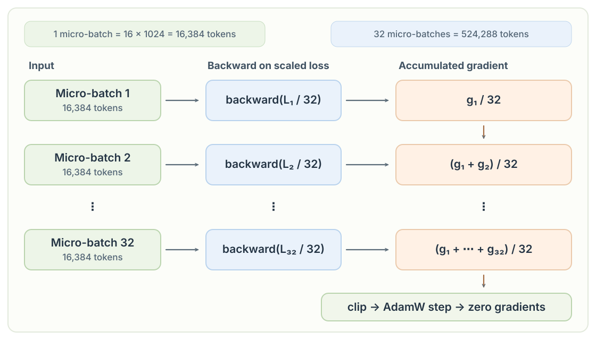
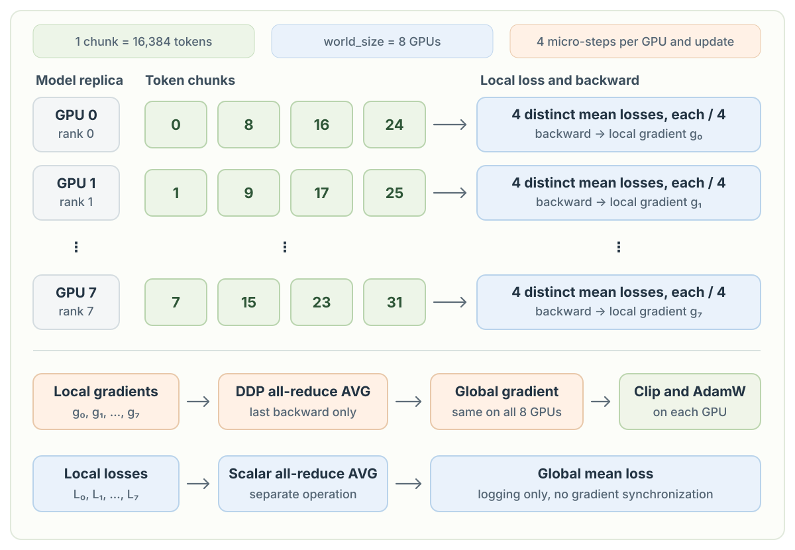

# Chapter 14: Gradient Accumulation and Distributed Training

## 1. Gradient accumulation

The target batch contains `524,288` tokens, but processing all of them in one forward and backward pass would require much more GPU memory for activations. Instead, each **micro-batch** has `B × T = 16 × 1024 = 16,384` tokens. We process `524,288 / 16,384 = 32` micro-batches before making one optimizer update. This keeps the activation memory closer to that of a single micro-batch while preserving the gradient of the larger batch. It does not eliminate the extra computation or the memory needed for parameters, gradients, and optimizer state.

If we passed all `524,288` tokens through the model at once, `F.cross_entropy` with its default mean reduction would return the **mean loss across all tokens**. In this loop, it instead returns a separate mean loss for each `16,384`-token micro-batch. Let $\ell_{m,j}$ be the loss for token $j$ in micro-batch $m$. Each micro-batch mean is

$$
L_m = \frac{1}{B T}\sum_{j=1}^{B T}\ell_{m,j}.
$$

Because all micro-batches have the same size, the mean loss we would obtain from the full batch is the **mean of those 32 means**, not their sum:

$$
L_{\mathrm{full}}
= \frac{1}{32 B T}\sum_{m=1}^{32}\sum_{j=1}^{B T}\ell_{m,j}
= \frac{1}{32}\sum_{m=1}^{32}L_m.
$$

Adding the micro-batch losses without dividing by 32 would make the result 32 times larger than the full-batch mean loss. Let $\theta$ denote the model parameters. The same averaging factor must apply when accumulating gradients:

$$
\nabla_{\theta}L_{\mathrm{full}}
= \sum_{m=1}^{32}\nabla_{\theta}\left(\frac{L_m}{32}\right).
$$

The code applies this division to each micro-batch loss **before** `backward()`. PyTorch adds each `backward()` result to the existing `.grad` tensors, so the 32 scaled gradients sum to the gradient of the full-batch mean loss. We do **not** clear gradients inside the micro-step loop: after all 32 backward passes, we clip the accumulated gradient, run `optimizer.step()` once, and then call `optimizer.zero_grad()` for the next effective batch. Without dividing each loss by 32, both the accumulated loss and its gradient would be 32 times larger than the intended mean-batch values.



```python
total_batch_size = 524288 # 2**19
B, T = 16, 1024
grad_accum_steps = total_batch_size // (B * T)
print("total batch size: ", total_batch_size)
print("grad_accum_steps: ", grad_accum_steps)
print("micro batch size: ", B * T)

torch.manual_seed(42)
if device == "cuda":
    torch.cuda.manual_seed(42)

model = GPT(GPTConfig(vocab_size=50304))
model.eval()
model.to(device)
model = torch.compile(model)

training_loader = DataLoaderLite(B, T)

# for GPUs supporting TF32
torch.set_float32_matmul_precision('high')

max_lr = 6e-4
min_lr = max_lr * 0.1
warmup_steps = 10
max_steps = 100

def get_lr(it):
    # 1) linear warmup for warmup_iters steps
    if it < warmup_steps:
        return max_lr * (it+1) / warmup_steps
    # 2) if it > lr_decay_iters, return min learning rate
    if it > max_steps:
        return min_lr
    # 3) in between, use cosine decay down to min learning rate
    decay_ratio = (it - warmup_steps) / (max_steps - warmup_steps)
    assert 0 <= decay_ratio <= 1
    coeff = 0.5 * (1.0 + math.cos(math.pi * decay_ratio)) # coeff starts at 1 and goes to 0
    return min_lr + coeff * (max_lr - min_lr)

optimizer = model.configure_optimizers(weight_decay=0.1, learning_rate=max_lr, device_type=device)

for i in range(100):
    start = time.time()
    loss_accum = 0.0
    for micro_step in range(grad_accum_steps):
        x, y = training_loader.next_batch()
        x = x.to(device)
        y = y.to(device)
        with torch.autocast(device_type=device, dtype=torch.bfloat16):
            logits, loss = model(x, y)
        loss = loss / grad_accum_steps
        loss_accum += loss.item()
        loss.backward()
    norm = torch.nn.utils.clip_grad_norm_(model.parameters(), 1.0)
    # pick the learning rate for this iteration
    lr = get_lr(i)
    for param_group in optimizer.param_groups:
        param_group['lr'] = lr
    optimizer.step()
    optimizer.zero_grad()
    if device == "cuda":
        torch.cuda.synchronize()
    epoch_time = (time.time() - start) * 1000 # ms
    tokens_per_second = total_batch_size / (epoch_time / 1000)
    if i % 10 == 0:
        print(f"step {i}, loss: {loss_accum:.6f}, norm: {norm:.2f}, lr: {lr:.9f}, epoch time: {epoch_time:.2f}ms, token/sec: {tokens_per_second:.2f}")
```


## 2. Distributed training

`torchrun` starts one process per GPU. This configuration keeps the effective batch at `524,288` tokens while distributing the work across eight GPUs.

| Setting | Value | Meaning |
| --- | ---: | --- |
| GPUs (`world_size`) | `8` | Eight processes, each with one model replica |
| Micro-batch size (`B`) | `16` | Sequences per GPU in one micro-step |
| Context length (`T`) | `1024` | Token positions per sequence |
| Tokens per micro-batch per GPU | `B × T = 16,384` | Work processed by one GPU in one micro-step |
| Gradient accumulation steps | `524,288 / (8 × 16,384) = 4` | Micro-steps per GPU before one optimizer update |
| Effective batch size | `8 × 4 × 16,384 = 524,288` tokens | Tokens contributing to one optimizer update across all GPUs |

Every process has its own copy of the model and its own `DataLoaderLite`. Each loader reads the same token file, but rank `r` starts at token offset `B × T × r` and advances by `B × T × world_size` after each batch. This gives the ranks different, non-overlapping chunks at the same micro-step. When a loader reaches the end of the file, it resets to its rank-specific starting offset. The chunk numbers in the diagram illustrate the stride before such a reset. Within each chunk, `x` contains the input tokens and `y` contains the same sequence shifted one token forward.

Each micro-batch returns a mean loss, which is divided by 4 before `backward()`. The four backward calls accumulate a local gradient on each GPU. DDP skips gradient synchronization for the first three micro-steps and synchronizes on the last one. Its gradient all-reduce averages the eight local gradients, so every GPU receives the same global gradient and can apply the same optimizer update.

The detached `loss_accum` values are also averaged across ranks with a separate `dist.all_reduce(..., AVG)`. This produces the global mean loss for logging. It is not the operation that synchronizes gradients.


