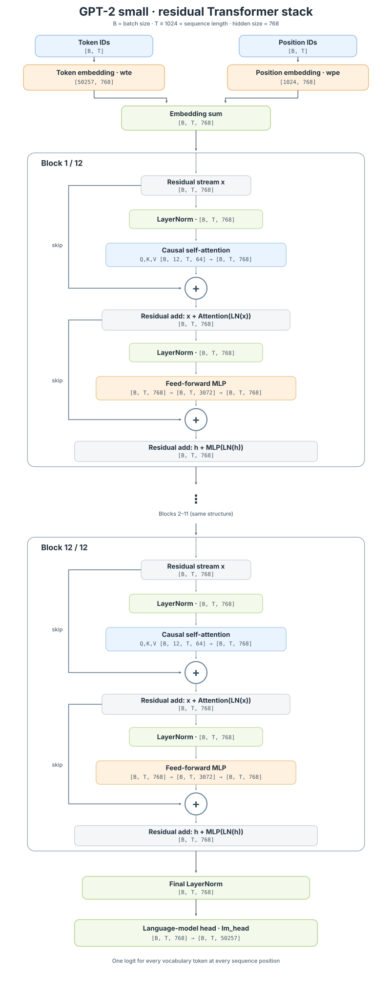

# Chapter 2: Implementing the GPT-2 Model

## 1. GPT-2 Specs

The `gpt2` checkpoint is the smallest GPT-2 configuration, often called **GPT-2 small**. It is a decoder-only Transformer with approximately **124 million trainable parameters**. The model reads a sequence from left to right and uses causal self-attention, so each position can attend only to tokens at or before that position.

| Parameter | Value | Meaning |
| --- | ---: | --- |
| Vocabulary size | `50,257` | Number of token IDs understood by the tokenizer |
| Context window (`n_positions`) | `1,024` | Maximum sequence length processed in one forward pass |
| Transformer blocks (`n_layer`) | `12` | Number of repeated Transformer blocks |
| Attention heads (`n_head`) | `12` | Number of parallel attention heads in each block |
| Embedding width (`n_embd`) | `768` | Width of token, position, and hidden-state vectors |
| Head dimension | `64` | `768 / 12`; the width of one attention head |
| Feed-forward width | `3,072` | The inner width of the MLP, `4 × 768` |
| Activation | `GELU` | Non-linearity used in the feed-forward network |
| Attention type | Causal self-attention | Prevents a token from looking at future tokens |
| Dropout | `0.1` | Dropout probability used by the original configuration during training |
| LayerNorm epsilon | `1e-5` | Small constant used for numerical stability in LayerNorm |
| Initialization range | `0.02` | Standard deviation used for the normal weight initialization |
| Output vocabulary | `50,257` logits | One next-token score for every vocabulary entry |

The token-embedding table therefore has shape `[50257, 768]`, while the positional-embedding table has shape `[1024, 768]`. For an input tensor with shape `[B, T]`, where `B` is the batch size and `T ≤ 1024` is the sequence length, the Transformer produces hidden states of shape `[B, T, 768]`. The language-model head then projects every hidden state to `[B, T, 50257]`, giving a score for the next token at every position.

GPT-2 ties the language-model head to the token-embedding matrix: the same learned token representations are reused when converting hidden states back into vocabulary logits. This reduces the number of independent parameters and keeps the input and output token spaces aligned.




```python
model_hf = GPT2LMHeadModel.from_pretrained("gpt2") # 124M
sd_hf = model_hf.state_dict()

for k, v in sd_hf.items():
    print(k, v.shape)
```

```text
transformer.wte.weight torch.Size([50257, 768])
transformer.wpe.weight torch.Size([1024, 768])
transformer.h.0.ln_1.weight torch.Size([768])
transformer.h.0.ln_1.bias torch.Size([768])
transformer.h.0.attn.c_attn.weight torch.Size([768, 2304])
transformer.h.0.attn.c_attn.bias torch.Size([2304])
transformer.h.0.attn.c_proj.weight torch.Size([768, 768])
transformer.h.0.attn.c_proj.bias torch.Size([768])
transformer.h.0.ln_2.weight torch.Size([768])
transformer.h.0.ln_2.bias torch.Size([768])
transformer.h.0.mlp.c_fc.weight torch.Size([768, 3072])
transformer.h.0.mlp.c_fc.bias torch.Size([3072])
transformer.h.0.mlp.c_proj.weight torch.Size([3072, 768])
transformer.h.0.mlp.c_proj.bias torch.Size([768])
transformer.h.1.ln_1.weight torch.Size([768])
transformer.h.1.ln_1.bias torch.Size([768])
transformer.h.1.attn.c_attn.weight torch.Size([768, 2304])
transformer.h.1.attn.c_attn.bias torch.Size([2304])
transformer.h.1.attn.c_proj.weight torch.Size([768, 768])
transformer.h.1.attn.c_proj.bias torch.Size([768])
transformer.h.1.ln_2.weight torch.Size([768])
transformer.h.1.ln_2.bias torch.Size([768])
transformer.h.1.mlp.c_fc.weight torch.Size([768, 3072])
transformer.h.1.mlp.c_fc.bias torch.Size([3072])
transformer.h.1.mlp.c_proj.weight torch.Size([3072, 768])
transformer.h.1.mlp.c_proj.bias torch.Size([768])
transformer.h.2.ln_1.weight torch.Size([768])
transformer.h.2.ln_1.bias torch.Size([768])
transformer.h.2.attn.c_attn.weight torch.Size([768, 2304])
transformer.h.2.attn.c_attn.bias torch.Size([2304])
transformer.h.2.attn.c_proj.weight torch.Size([768, 768])
transformer.h.2.attn.c_proj.bias torch.Size([768])
transformer.h.2.ln_2.weight torch.Size([768])
transformer.h.2.ln_2.bias torch.Size([768])
transformer.h.2.mlp.c_fc.weight torch.Size([768, 3072])
transformer.h.2.mlp.c_fc.bias torch.Size([3072])
transformer.h.2.mlp.c_proj.weight torch.Size([3072, 768])
transformer.h.2.mlp.c_proj.bias torch.Size([768])
transformer.h.3.ln_1.weight torch.Size([768])
transformer.h.3.ln_1.bias torch.Size([768])
transformer.h.3.attn.c_attn.weight torch.Size([768, 2304])
transformer.h.3.attn.c_attn.bias torch.Size([2304])
transformer.h.3.attn.c_proj.weight torch.Size([768, 768])
transformer.h.3.attn.c_proj.bias torch.Size([768])
transformer.h.3.ln_2.weight torch.Size([768])
transformer.h.3.ln_2.bias torch.Size([768])
transformer.h.3.mlp.c_fc.weight torch.Size([768, 3072])
transformer.h.3.mlp.c_fc.bias torch.Size([3072])
transformer.h.3.mlp.c_proj.weight torch.Size([3072, 768])
transformer.h.3.mlp.c_proj.bias torch.Size([768])
transformer.h.4.ln_1.weight torch.Size([768])
transformer.h.4.ln_1.bias torch.Size([768])
transformer.h.4.attn.c_attn.weight torch.Size([768, 2304])
transformer.h.4.attn.c_attn.bias torch.Size([2304])
transformer.h.4.attn.c_proj.weight torch.Size([768, 768])
transformer.h.4.attn.c_proj.bias torch.Size([768])
transformer.h.4.ln_2.weight torch.Size([768])
transformer.h.4.ln_2.bias torch.Size([768])
transformer.h.4.mlp.c_fc.weight torch.Size([768, 3072])
transformer.h.4.mlp.c_fc.bias torch.Size([3072])
transformer.h.4.mlp.c_proj.weight torch.Size([3072, 768])
transformer.h.4.mlp.c_proj.bias torch.Size([768])
transformer.h.5.ln_1.weight torch.Size([768])
transformer.h.5.ln_1.bias torch.Size([768])
transformer.h.5.attn.c_attn.weight torch.Size([768, 2304])
transformer.h.5.attn.c_attn.bias torch.Size([2304])
transformer.h.5.attn.c_proj.weight torch.Size([768, 768])
transformer.h.5.attn.c_proj.bias torch.Size([768])
transformer.h.5.ln_2.weight torch.Size([768])
transformer.h.5.ln_2.bias torch.Size([768])
transformer.h.5.mlp.c_fc.weight torch.Size([768, 3072])
transformer.h.5.mlp.c_fc.bias torch.Size([3072])
transformer.h.5.mlp.c_proj.weight torch.Size([3072, 768])
transformer.h.5.mlp.c_proj.bias torch.Size([768])
transformer.h.6.ln_1.weight torch.Size([768])
transformer.h.6.ln_1.bias torch.Size([768])
transformer.h.6.attn.c_attn.weight torch.Size([768, 2304])
transformer.h.6.attn.c_attn.bias torch.Size([2304])
transformer.h.6.attn.c_proj.weight torch.Size([768, 768])
transformer.h.6.attn.c_proj.bias torch.Size([768])
transformer.h.6.ln_2.weight torch.Size([768])
transformer.h.6.ln_2.bias torch.Size([768])
transformer.h.6.mlp.c_fc.weight torch.Size([768, 3072])
transformer.h.6.mlp.c_fc.bias torch.Size([3072])
transformer.h.6.mlp.c_proj.weight torch.Size([3072, 768])
transformer.h.6.mlp.c_proj.bias torch.Size([768])
transformer.h.7.ln_1.weight torch.Size([768])
transformer.h.7.ln_1.bias torch.Size([768])
transformer.h.7.attn.c_attn.weight torch.Size([768, 2304])
transformer.h.7.attn.c_attn.bias torch.Size([2304])
transformer.h.7.attn.c_proj.weight torch.Size([768, 768])
transformer.h.7.attn.c_proj.bias torch.Size([768])
transformer.h.7.ln_2.weight torch.Size([768])
transformer.h.7.ln_2.bias torch.Size([768])
transformer.h.7.mlp.c_fc.weight torch.Size([768, 3072])
transformer.h.7.mlp.c_fc.bias torch.Size([3072])
transformer.h.7.mlp.c_proj.weight torch.Size([3072, 768])
transformer.h.7.mlp.c_proj.bias torch.Size([768])
transformer.h.8.ln_1.weight torch.Size([768])
transformer.h.8.ln_1.bias torch.Size([768])
transformer.h.8.attn.c_attn.weight torch.Size([768, 2304])
transformer.h.8.attn.c_attn.bias torch.Size([2304])
transformer.h.8.attn.c_proj.weight torch.Size([768, 768])
transformer.h.8.attn.c_proj.bias torch.Size([768])
transformer.h.8.ln_2.weight torch.Size([768])
transformer.h.8.ln_2.bias torch.Size([768])
transformer.h.8.mlp.c_fc.weight torch.Size([768, 3072])
transformer.h.8.mlp.c_fc.bias torch.Size([3072])
transformer.h.8.mlp.c_proj.weight torch.Size([3072, 768])
transformer.h.8.mlp.c_proj.bias torch.Size([768])
transformer.h.9.ln_1.weight torch.Size([768])
transformer.h.9.ln_1.bias torch.Size([768])
transformer.h.9.attn.c_attn.weight torch.Size([768, 2304])
transformer.h.9.attn.c_attn.bias torch.Size([2304])
transformer.h.9.attn.c_proj.weight torch.Size([768, 768])
transformer.h.9.attn.c_proj.bias torch.Size([768])
transformer.h.9.ln_2.weight torch.Size([768])
transformer.h.9.ln_2.bias torch.Size([768])
transformer.h.9.mlp.c_fc.weight torch.Size([768, 3072])
transformer.h.9.mlp.c_fc.bias torch.Size([3072])
transformer.h.9.mlp.c_proj.weight torch.Size([3072, 768])
transformer.h.9.mlp.c_proj.bias torch.Size([768])
transformer.h.10.ln_1.weight torch.Size([768])
transformer.h.10.ln_1.bias torch.Size([768])
transformer.h.10.attn.c_attn.weight torch.Size([768, 2304])
transformer.h.10.attn.c_attn.bias torch.Size([2304])
transformer.h.10.attn.c_proj.weight torch.Size([768, 768])
transformer.h.10.attn.c_proj.bias torch.Size([768])
transformer.h.10.ln_2.weight torch.Size([768])
transformer.h.10.ln_2.bias torch.Size([768])
transformer.h.10.mlp.c_fc.weight torch.Size([768, 3072])
transformer.h.10.mlp.c_fc.bias torch.Size([3072])
transformer.h.10.mlp.c_proj.weight torch.Size([3072, 768])
transformer.h.10.mlp.c_proj.bias torch.Size([768])
transformer.h.11.ln_1.weight torch.Size([768])
transformer.h.11.ln_1.bias torch.Size([768])
transformer.h.11.attn.c_attn.weight torch.Size([768, 2304])
transformer.h.11.attn.c_attn.bias torch.Size([2304])
transformer.h.11.attn.c_proj.weight torch.Size([768, 768])
transformer.h.11.attn.c_proj.bias torch.Size([768])
transformer.h.11.ln_2.weight torch.Size([768])
transformer.h.11.ln_2.bias torch.Size([768])
transformer.h.11.mlp.c_fc.weight torch.Size([768, 3072])
transformer.h.11.mlp.c_fc.bias torch.Size([3072])
transformer.h.11.mlp.c_proj.weight torch.Size([3072, 768])
transformer.h.11.mlp.c_proj.bias torch.Size([768])
transformer.ln_f.weight torch.Size([768])
transformer.ln_f.bias torch.Size([768])
lm_head.weight torch.Size([50257, 768])
```

## 2. GPT-2 model

```python
class CausalSelfAttention(nn.Module):

    def __init__(self, config):
        super().__init__()
        assert config.n_embd % config.n_head == 0
        # key, query, value projections for all heads, but in a batch
        self.c_attn = nn.Linear(config.n_embd, 3 * config.n_embd)
        # output projection
        self.c_proj = nn.Linear(config.n_embd, config.n_embd)
        self.c_proj.NANOGPT_SCALE_INIT = 1
        # regularization
        self.n_head = config.n_head
        self.n_embd = config.n_embd

    def forward(self, x):
        B, T, C = x.size() # batch size, sequence length, embedding dimensionality (n_embd)
        qkv = self.c_attn(x)
        q, k, v = qkv.split(self.n_embd, dim=2)
        k = k.view(B, T, self.n_head, C // self.n_head).transpose(1, 2) # (B, n_head, T, head_size)
        q = q.view(B, T, self.n_head, C // self.n_head).transpose(1, 2) # (B, n_head, T, head_size)
        v = v.view(B, T, self.n_head, C // self.n_head).transpose(1, 2) # (B, n_head, T, head_size)
        y = F.scaled_dot_product_attention(q, k, v, is_causal=True) # flash attention
        y = y.transpose(1, 2).contiguous().view(B, T, C)
        # output projection
        y = self.c_proj(y)
        return y

class MLP(nn.Module):

    def __init__(self, config):
        super().__init__()
        self.c_fc    = nn.Linear(config.n_embd, 4 * config.n_embd)
        self.gelu    = nn.GELU(approximate='tanh')
        self.c_proj  = nn.Linear(4 * config.n_embd, config.n_embd)
        self.c_proj.NANOGPT_SCALE_INIT = 1

    def forward(self, x):
        x = self.c_fc(x)
        x = self.gelu(x)
        x = self.c_proj(x)
        return x

class Block(nn.Module):

    def __init__(self, config):
        super().__init__()
        self.ln_1 = nn.LayerNorm(config.n_embd)
        self.attn = CausalSelfAttention(config)
        self.ln_2 = nn.LayerNorm(config.n_embd)
        self.mlp = MLP(config)

    def forward(self, x):
        x = x + self.attn(self.ln_1(x))
        x = x + self.mlp(self.ln_2(x))
        return x

@dataclass
class GPTConfig:
    block_size: int = 1024 # max sequence length
    vocab_size: int = 50257 # number of tokens: 50,000 BPE merges + 256 bytes tokens + 1 <|endoftext|> token
    n_layer: int = 12 # number of layers
    n_head: int = 12 # number of heads
    n_embd: int = 768 # embedding dimension

class GPT(nn.Module):

    def __init__(self, config):
        super().__init__()
        self.config = config

        self.transformer = nn.ModuleDict(dict(
            wte = nn.Embedding(config.vocab_size, config.n_embd),
            wpe = nn.Embedding(config.block_size, config.n_embd),
            h = nn.ModuleList([Block(config) for _ in range(config.n_layer)]),
            ln_f = nn.LayerNorm(config.n_embd),
        ))
        self.lm_head = nn.Linear(config.n_embd, config.vocab_size, bias=False)
```

The model defined above is intentionally named and parameterized to match the pretrained `gpt2` checkpoint. This is more than a naming preference: matching the module hierarchy lets us compare the two `state_dict`s and copy the pretrained tensors into our implementation without changing their meaning.

The `GPTConfig` values are the GPT-2 small configuration: `block_size=1024`, `vocab_size=50257`, `n_layer=12`, `n_head=12`, and `n_embd=768`. The model then follows the same top-level structure as the Hugging Face checkpoint:

- `transformer.wte` is the token-embedding table.
- `transformer.wpe` is the positional-embedding table.
- `transformer.h[i]` is the `i`-th Transformer block, with `ln_1`, `attn`, `ln_2`, and `mlp` submodules.
- `transformer.ln_f` is the final layer normalization.
- `lm_head` projects each final hidden state back to the `50257` vocabulary logits.

`CausalSelfAttention` implements all attention heads together in one vectorized operation. Instead of creating a separate Python module and forward pass for each of the 12 heads, `c_attn` produces the query, key, and value projections for every head at once. The result is reshaped from `[B, T, 3 × 768]` into per-head tensors of shape `[B, 12, T, 64]`, then passed to `F.scaled_dot_product_attention` in a single call. This keeps the same multi-head-attention mathematics while making the implementation more efficient by avoiding Python-level loops and enabling optimized attention kernels.

Inside each block, the projection names also line up with the checkpoint: `attn.c_attn` contains the combined query, key, and value projection, `attn.c_proj` is the attention output projection, `mlp.c_fc` expands the hidden dimension to `4 × n_embd`, and `mlp.c_proj` maps it back to `n_embd`. With this one-to-one correspondence, our model has the same architecture and tensor shapes as pretrained GPT-2, so the checkpoint can be loaded layer by layer.
