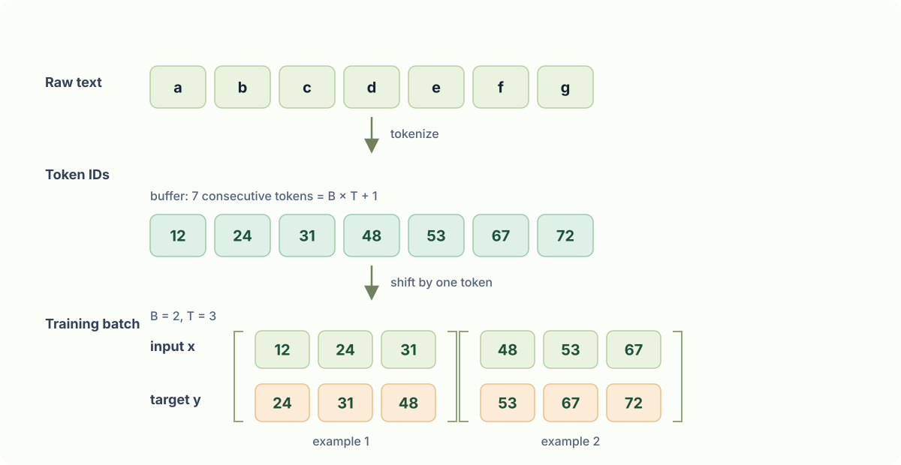

# Chapter 6: Training Batches and Cross-Entropy

## 1. Prepare training data

Language-model training turns one long token stream into many next-token prediction examples. After encoding the text with the GPT-2 tokenizer, this example takes `B × T + 1` consecutive tokens. The extra token is necessary because the target sequence is the input sequence shifted one position to the left.



```python
# tiny shakespeare dataset
# !wget https://raw.githubusercontent.com/karpathy/char-rnn/master/data/tinyshakespeare/input.txt

import tiktoken
import torch

with open('input.txt', 'r') as f:
    text = f.read()
data = text[:1000] # first 1000 characters

B, T = 2, 3

enc = tiktoken.get_encoding("gpt2")
tokens = enc.encode(data)

buf = torch.tensor(tokens[: B * T + 1])
# input
x = buf[:-1].view(B, T)
# output
y = buf[1:].view(B, T)

print(x)
print(y)
```

```text
tensor([[ 5962, 22307,    25],
        [  198,  8421,   356]])
tensor([[22307,    25,   198],
        [ 8421,   356,  5120]])
```

For the first row, the model receives `[5962, 22307, 25]` and is trained to predict `[22307, 25, 198]`. Therefore every input position has a target: token `5962` predicts `22307`, `22307` predicts `25`, and so on. Reshaping into `[B, T]` simply groups consecutive predictions into a batch; it does not break the original token order.

## 2. Cross-Entropy loss

The `forward` function now accepts `targets` in addition to the input token IDs. Its logits have shape `[B, T, 50257]`: each of the `B × T` positions produces one score for every possible vocabulary token. The target tensor has shape `[B, T]`, containing the correct next-token ID for each corresponding position.

```python
class GPT(nn.Module):

    def __init__(self, config):
        ...

    def forward(self, idx, targets=None):
        # idx is of shape (B, T)
        # target is (B, T)
        B, T = idx.size()
        assert T <= self.config.block_size, f"Cannot forward sequence of length {T}, block size is only {self.config.block_size}"
        # forward the token and posisition embeddings
        pos = torch.arange(0, T, dtype=torch.long, device=idx.device) # shape (T)
        pos_emb = self.transformer.wpe(pos) # position embeddings of shape (T, n_embd)
        tok_emb = self.transformer.wte(idx) # token embeddings of shape (B, T, n_embd)
        x = tok_emb + pos_emb
        # forward the blocks of the transformer
        for block in self.transformer.h:
            x = block(x)
        # forward the final layernorm and the classifier
        x = self.transformer.ln_f(x)
        logits = self.lm_head(x) # (B, T, vocab_size)
        loss = None
        print("logits shape:", logits.shape)
        print("targets shape:", targets.shape)
        if targets is not None:
            loss = F.cross_entropy(logits.view(-1, logits.size(-1)), targets.view(-1))
        return logits, loss
```

```python
model = GPT(GPTConfig())
model.eval()
model.to(device)

logits, loss = model(x, y)
print(loss)
```

```text
logits shape: torch.Size([4, 32, 50257])
targets shape: torch.Size([4, 32])
tensor(10.9276, grad_fn=<NllLossBackward0>)
```

`F.cross_entropy` expects a two-dimensional score tensor and a one-dimensional target tensor, so the code flattens `[B, T, 50257]` into `[B × T, 50257]` and `[B, T]` into `[B × T]`. It then applies softmax internally, reads the probability assigned to every correct next token, and averages the negative log-probabilities into one scalar loss.

The printed shapes use a later training setting of `B=4` and `T=32`, while the small data-preparation example above uses `B=2` and `T=3` to make the shifted targets easy to inspect. A newly initialized GPT-2-sized model has a loss near `log(50257) ≈ 10.8`, because it initially assigns almost uniform probability across the vocabulary. The displayed loss of `10.9276` is therefore the expected starting point before training improves its predictions.
