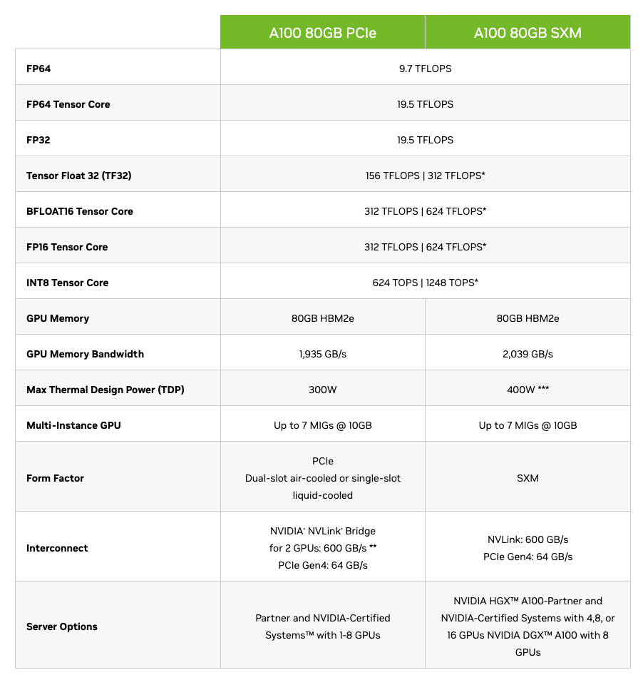

# Chapter 9: Making Training Fast

## 1. Tensor types

The A100 exposes different numerical formats for different parts of training. They are not interchangeable labels for the same calculation: each one makes a trade-off between numerical precision, memory traffic, and Tensor Core throughput.



*Source: [NVIDIA A100 specifications](https://www.nvidia.com/en-us/data-center/a100/).*

### FP32

FP32 (`torch.float32`) is the standard single-precision floating-point format. It has the widest precision of the three formats discussed here, so it is the dependable choice for quantities that are sensitive to small numerical changes—for example, an optimizer's state, reductions, and loss calculations. The trade-off is cost: FP32 values occupy 4 bytes each, and ordinary FP32 matrix multiplication does not use the A100 Tensor Cores as efficiently as the lower-precision modes. The A100 specification lists 19.5 TFLOPS for FP32.

### TF32

TF32 is an A100 Tensor Core math mode for matrix multiplications; it is not normally a tensor-storage dtype that you select for model parameters. It preserves FP32's 8-bit exponent range but uses a 10-bit mantissa for the Tensor Core multiply, with FP32 accumulation. This gives it much of FP32's range while making large matrix multiplies substantially faster. On the A100, Tensor Float 32 is rated at 156 TFLOPS (or 312 TFLOPS with structured sparsity), compared with 19.5 TFLOPS for ordinary FP32.

For a first FP32 training implementation, TF32 is a useful speedup because it can accelerate the large linear layers without rewriting the model into a lower-precision format. It does introduce slightly different numerical results from full FP32, so exact reproducibility and numerically delicate workloads may require disabling it.

### bfloat16

bfloat16 (`torch.bfloat16`) keeps FP32's 8-bit exponent, so it covers a similarly large range of magnitudes, but it has a much shorter 7-bit fraction. It needs only 2 bytes per value, reducing activation and memory bandwidth costs. A100 Tensor Cores deliver 312 TFLOPS for BF16 (or 624 TFLOPS with structured sparsity), which makes it the primary format for high-throughput mixed-precision training.

In practice, mixed precision commonly runs the expensive forward and backward matrix multiplications in bfloat16 while retaining selected sensitive values in FP32. The wide exponent range makes bfloat16 generally more forgiving than FP16 for deep-learning training, although it still has less precision than FP32. The right approach is empirical: measure throughput and verify that loss and evaluation behavior remain stable.

## 2. Training with fp32

This is the baseline: model parameters, activations, and matrix multiplications use ordinary FP32. The TF32 setting remains commented out, so the measured throughput gives us a reference for the same model, batch size, and data loader.

```python
# tiny shakespeare dataset
# !wget https://raw.githubusercontent.com/karpathy/char-rnn/master/data/tinyshakespeare/input.txt

import tiktoken
import torch
import time

device = "cpu"
if torch.cuda.is_available():
    device = "cuda"
elif hasattr(torch.backends, "mps") and torch.backends.mps.is_available():
    device = "mps"
print("using device:", device)

B, T = 4, 128

torch.manual_seed(42)
if device == "cuda":
    torch.cuda.manual_seed(42)

model = GPT(GPTConfig())
model.eval()
model.to(device)

training_loader = DataLoaderLite(B, T)

# for GPUs supporting TF32
# torch.set_float32_matmul_precision('high')

optimizer = torch.optim.AdamW(model.parameters(), lr=1e-3)

for i in range(100):
    start = time.time()
    x, y = training_loader.next_batch()
    x = x.to(device)
    y = y.to(device)
    logits, loss = model(x, y)
    loss.backward()
    optimizer.step()
    optimizer.zero_grad()
    if device == "cuda":
        torch.cuda.synchronize()
    epoch_time = (time.time() - start) * 1000 # ms
    tokens_per_second = (training_loader.B * training_loader.T) / (epoch_time / 1000)
    if i % 10 == 0:
        print(f"step {i}, loss: {loss.item()}, epoch time: {epoch_time:.2f}ms, token_per_second: {tokens_per_second:.2f}")
```

```text
using device: cuda
loaded 338025 tokens
1 epoch = 660 batches
step 0, loss: 11.025571823120117, epoch time: 43.46ms, token_per_second: 11782.27
step 10, loss: 7.654312610626221, epoch time: 35.76ms, token_per_second: 14318.18
step 20, loss: 6.965814113616943, epoch time: 35.71ms, token_per_second: 14339.02
step 30, loss: 7.273531436920166, epoch time: 35.70ms, token_per_second: 14340.36
step 40, loss: 5.822754859924316, epoch time: 35.74ms, token_per_second: 14327.54
step 50, loss: 6.045305252075195, epoch time: 35.71ms, token_per_second: 14338.16
step 60, loss: 5.828420639038086, epoch time: 35.71ms, token_per_second: 14337.30
step 70, loss: 6.148750305175781, epoch time: 35.74ms, token_per_second: 14325.73
step 80, loss: 6.203412055969238, epoch time: 35.87ms, token_per_second: 14275.44
step 90, loss: 6.275454044342041, epoch time: 35.88ms, token_per_second: 14269.09
```

After the first warm-up step, this run sustains about 14.3K tokens/s. We will compare the other modes against this number; the loss is the accuracy check, while tokens/s measures speed.

## 3. Training with TF32

The only intended change is `torch.set_float32_matmul_precision('high')`. Tensors still appear as FP32 in the Python code, but eligible CUDA matrix multiplications can use A100 Tensor Cores in TF32 mode.

```python
# tiny shakespeare dataset
# !wget https://raw.githubusercontent.com/karpathy/char-rnn/master/data/tinyshakespeare/input.txt

import tiktoken
import torch
import time

device = "cpu"
if torch.cuda.is_available():
    device = "cuda"
elif hasattr(torch.backends, "mps") and torch.backends.mps.is_available():
    device = "mps"
print("using device:", device)

B, T = 4, 128

torch.manual_seed(42)
if device == "cuda":
    torch.cuda.manual_seed(42)

model = GPT(GPTConfig())
model.eval()
model.to(device)

training_loader = DataLoaderLite(B, T)

# for GPUs supporting TF32
torch.set_float32_matmul_precision('high')

optimizer = torch.optim.AdamW(model.parameters(), lr=1e-3)

for i in range(100):
    start = time.time()
    x, y = training_loader.next_batch()
    x = x.to(device)
    y = y.to(device)
    logits, loss = model(x, y)
    loss.backward()
    optimizer.step()
    optimizer.zero_grad()
    if device == "cuda":
        torch.cuda.synchronize()
    epoch_time = (time.time() - start) * 1000 # ms
    tokens_per_second = (training_loader.B * training_loader.T) / (epoch_time / 1000)
    if i % 10 == 0:
        print(f"step {i}, loss: {loss.item()}, epoch time: {epoch_time:.2f}ms, token_per_second: {tokens_per_second:.2f}")
```

```text
using device: cuda
loaded 338025 tokens
1 epoch = 660 batches
step 0, loss: 11.02548599243164, epoch time: 82.36ms, token_per_second: 6216.25
step 10, loss: 7.654457092285156, epoch time: 25.68ms, token_per_second: 19934.31
step 20, loss: 6.9657769203186035, epoch time: 24.57ms, token_per_second: 20838.63
step 30, loss: 7.273409843444824, epoch time: 24.39ms, token_per_second: 20992.64
step 40, loss: 5.822718620300293, epoch time: 24.78ms, token_per_second: 20660.20
step 50, loss: 6.0453033447265625, epoch time: 24.30ms, token_per_second: 21066.15
step 60, loss: 5.825943470001221, epoch time: 24.19ms, token_per_second: 21169.36
step 70, loss: 6.1855058670043945, epoch time: 24.51ms, token_per_second: 20887.28
step 80, loss: 6.217161655426025, epoch time: 24.23ms, token_per_second: 21134.57
step 90, loss: 6.2714738845825195, epoch time: 23.78ms, token_per_second: 21528.66
```

TF32 reaches about 21K tokens/s here—roughly 1.5× the FP32 baseline—while the loss curve stays very close. This makes TF32 a low-effort speedup when its small numerical differences are acceptable.

## 4. Training with bfloat16

`torch.autocast` selects bfloat16 for supported operations inside the forward pass while PyTorch keeps numerically sensitive operations in a safer format when needed. The code does not permanently convert the model parameters; autocast manages the operation-level casting for this region.

```python
# tiny shakespeare dataset
# !wget https://raw.githubusercontent.com/karpathy/char-rnn/master/data/tinyshakespeare/input.txt

import tiktoken
import torch
import time

device = "cpu"
if torch.cuda.is_available():
    device = "cuda"
elif hasattr(torch.backends, "mps") and torch.backends.mps.is_available():
    device = "mps"
print("using device:", device)

B, T = 4, 128

torch.manual_seed(42)
if device == "cuda":
    torch.cuda.manual_seed(42)

model = GPT(GPTConfig())
model.eval()
model.to(device)

training_loader = DataLoaderLite(B, T)

# for GPUs supporting TF32
# torch.set_float32_matmul_precision('high')

optimizer = torch.optim.AdamW(model.parameters(), lr=1e-3)

for i in range(100):
    start = time.time()
    x, y = training_loader.next_batch()
    x = x.to(device)
    y = y.to(device)
    # cast to bfloat16
    with torch.autocast(device_type=device, dtype=torch.bfloat16):
        logits, loss = model(x, y)
    loss.backward()
    optimizer.step()
    optimizer.zero_grad()
    if device == "cuda":
        torch.cuda.synchronize()
    epoch_time = (time.time() - start) * 1000 # ms
    tokens_per_second = (training_loader.B * training_loader.T) / (epoch_time / 1000)
    if i % 10 == 0:
        print(f"step {i}, loss: {loss.item()}, epoch time: {epoch_time:.2f}ms, token_per_second: {tokens_per_second:.2f}")
```

```text
using device: cuda
loaded 338025 tokens
1 epoch = 660 batches
step 0, loss: 11.025634765625, epoch time: 37.09ms, token_per_second: 13802.73
step 10, loss: 7.6519622802734375, epoch time: 29.76ms, token_per_second: 17206.02
step 20, loss: 6.96630859375, epoch time: 29.11ms, token_per_second: 17587.48
step 30, loss: 7.27362060546875, epoch time: 30.42ms, token_per_second: 16829.28
step 40, loss: 5.824798583984375, epoch time: 29.18ms, token_per_second: 17544.66
step 50, loss: 6.0440521240234375, epoch time: 28.56ms, token_per_second: 17925.87
step 60, loss: 5.8260498046875, epoch time: 28.20ms, token_per_second: 18153.94
step 70, loss: 6.236297607421875, epoch time: 28.64ms, token_per_second: 17874.40
step 80, loss: 6.2033538818359375, epoch time: 28.86ms, token_per_second: 17738.27
step 90, loss: 6.314033508300781, epoch time: 28.69ms, token_per_second: 17847.81
```

This bfloat16 run reaches about 17–18K tokens/s and follows a similar loss trend. It is faster than the FP32 baseline in this small experiment, though TF32 is faster for this particular model and batch size. Real workloads should benchmark both modes rather than assuming one is always best.

## 5. Ops and autocast

`torch.autocast` does **not** convert every operation in its block to a low-precision type. It applies a per-operation policy. The following CUDA lists are the relevant categories from the [PyTorch AMP CUDA op reference](https://docs.pytorch.org/docs/2.14/amp.html#cuda-ops-that-can-autocast-to-float16). The reference labels the low-precision list as `float16`; when this chapter uses `dtype=torch.bfloat16`, the same policy selects bfloat16 for eligible operations.

### Operations eligible for low precision

These are primarily the high-throughput matrix and convolution operations: `__matmul__`, `addbmm`, `addmm`, `addmv`, `addr`, `baddbmm`, `bmm`, `chain_matmul`, `multi_dot`, `conv1d`, `conv2d`, `conv3d`, `conv_transpose1d`, `conv_transpose2d`, `conv_transpose3d`, `GRUCell`, `linear`, `LSTMCell`, `matmul`, `mm`, `mv`, `prelu`, and `RNNCell`.

### Operations that autocast to FP32

These operations are kept in FP32 because they are more sensitive to numerical range or precision: `__pow__`, `__rdiv__`, `__rpow__`, `__rtruediv__`, `acos`, `asin`, `binary_cross_entropy_with_logits`, `cosh`, `cosine_embedding_loss`, `cdist`, `cosine_similarity`, `cross_entropy`, `cumprod`, `cumsum`, `dist`, `erfinv`, `exp`, `expm1`, `group_norm`, `hinge_embedding_loss`, `kl_div`, `l1_loss`, `layer_norm`, `log`, `log_softmax`, `log10`, `log1p`, `log2`, `margin_ranking_loss`, `mse_loss`, `multilabel_margin_loss`, `multi_margin_loss`, `nll_loss`, `norm`, `normalize`, `pdist`, `poisson_nll_loss`, `pow`, `prod`, `reciprocal`, `rsqrt`, `sinh`, `smooth_l1_loss`, `soft_margin_loss`, `softmax`, `softmin`, `softplus`, `sum`, `renorm`, `tan`, and `triplet_margin_loss`.

### Operations that promote to the widest input type

For `addcdiv`, `addcmul`, `atan2`, `bilinear`, `cross`, `dot`, `grid_sample`, `index_put`, `scatter_add`, and `tensordot`, all inputs are promoted to match the widest input type. For example, if any input is FP32, the operation runs in FP32. Operations outside these eligibility lists keep the dtype determined by their inputs. This is why autocast is genuinely mixed precision: it accelerates the expensive matrix multiplications while preserving FP32 where stability matters.
