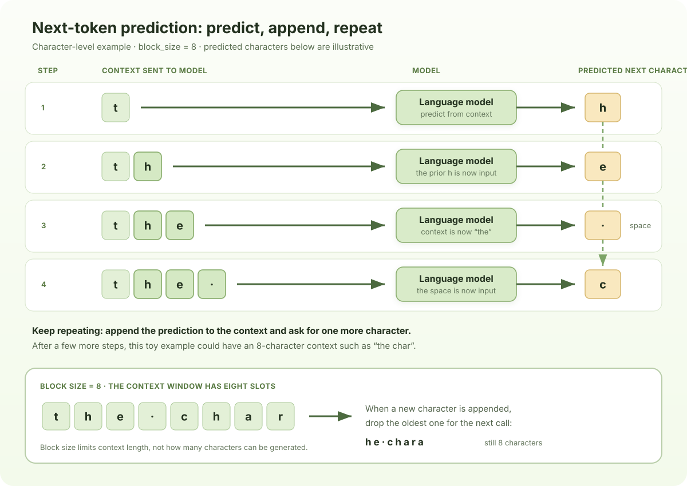

# Chapter 1: Building the Dataset

Before a language model can learn, we need to prepare its text corpus. We will download a small dataset, inspect the text, build a character-level vocabulary, encode it as a PyTorch tensor, and split it into training and validation data.

## 1. Download the dataset

Download the dataset.

```python
!wget https://raw.githubusercontent.com/core-computings/llm-101/main/static/files/The-Old-Man-and-the-Sea.txt
```

## 2. Read and inspect the text

Read the complete text into one Python string. Start by checking its length and previewing only a small prefix so you can confirm that the file loaded correctly.

```python
with open('The-Old-Man-and-the-Sea.txt', 'r', encoding='utf-8') as f:
    text = f.read()
print("length of dataset in characters: ", len(text))
print(text[:100])
```

```text
length of dataset in characters:  133605
He was an old man who fished alone in a skiff in the Gulf Stream and he had gone eighty-four days no
```

The `500` here is only for display. The full corpus remains in `text`. A UTF-8 decoding error usually means the file uses a different encoding; inspect the source before changing the encoding guess.

## 3. Build a character vocabulary

This first model works at the character level. Every distinct character in the corpus gets one integer ID. Sorting makes the mapping deterministic: the same corpus always produces the same order.

```python
chars = sorted(set(text))
vocab_size = len(chars)

print("vocabulary size:", vocab_size)
print("".join(chars))
```

```text
 !"',-.:;?ABCDEFGHIJKLMNOPQRSTUVWYabcdefghijklmnopqrstuvwxyzé
62
```

Spaces, newlines, punctuation, and uppercase letters are all characters and therefore receive their own IDs. This vocabulary is specific to the corpus: a character that never appears in the training text cannot be encoded by this mapping.

## 4. Encode and decode

Create a lookup table in each direction. `stoi` means “string to integer,” and `itos` means “integer to string.”

```python
stoi = {ch: i for i, ch in enumerate(chars)}
itos = {i: ch for i, ch in enumerate(chars)}

def encode(s):
    return [stoi[ch] for ch in s]

def decode(ids):
    return "".join(itos[i] for i in ids)
```

```text
[49, 46, 38, 1, 47, 35, 48, 1, 35, 48, 38, 1, 53, 39, 35]
old man and sea
```

Check that a short string survives a round trip:

```python
sample = text[:20]  # use characters that are guaranteed to exist in this corpus
ids = encode(sample)

print(ids)
print(decode(ids))
assert decode(ids) == sample
```

The integer sequence is what the model consumes. At this stage, one visible character equals one token. Later, a subword tokenizer can replace this mapping while the model still receives integer IDs.

## 5. Encode the full corpus as a tensor

Convert all characters to IDs, then place the IDs in a PyTorch tensor. `torch.long` is the integer type expected by embedding layers and classification losses.

```python
import torch

data = torch.tensor(encode(text), dtype=torch.long)
print(data.shape, data.dtype)
print(data[:100])
```

```text
torch.Size([133605]) torch.int64
tensor([18, 39,  1, 57, 35, 53,  1, 35, 48,  1, 49, 46, 38,  1, 47, 35, 48,  1,
        57, 42, 49,  1, 40, 43, 53, 42, 39, 38,  1, 35, 46, 49, 48, 39,  1, 43,
        48,  1, 35,  1, 53, 45, 43, 40, 40,  1, 43, 48,  1, 54, 42, 39,  1, 17,
        55, 46, 40,  1, 29, 54, 52, 39, 35, 47,  1, 35, 48, 38,  1, 42, 39,  1,
        42, 35, 38,  1, 41, 49, 48, 39,  1, 39, 43, 41, 42, 54, 59,  6, 40, 49,
        55, 52,  1, 38, 35, 59, 53,  1, 48, 49])
```

If the corpus contains `N` characters, `data` has shape `(N,)`: one long sequence of token IDs.

## 6. Split training and validation data

Keep the final 10% of the corpus for validation. The model will train on the first 90%; validation data lets us check whether it predicts text it did not train on.

```python
n = int(0.9 * len(data))
train_data = data[:n]
val_data = data[n:]

print("training tokens:", len(train_data))
print("validation tokens:", len(val_data))
```

```text
training tokens: 120244
validation tokens: 13361
```

For a single ordered book or document, a contiguous split is simple and preserves the original sequence. For independent documents, split by document instead so parts of the same document do not leak into both sets.

## 7. Create one next-token example

The model learns from a context and the same context shifted one character forward. If the context length is eight, each input chunk contains eight IDs and its target contains the next eight IDs.

```python
block_size = 8

x = train_data[:block_size]
y = train_data[1:block_size+1]
for t in range(block_size):
    context = x[:t+1]
    target = y[t]
    print(f"when input is {context} the target: {target}")
```

```text
when input is tensor([18]) the target: 39
when input is tensor([18, 39]) the target: 1
when input is tensor([18, 39,  1]) the target: 57
when input is tensor([18, 39,  1, 57]) the target: 35
when input is tensor([18, 39,  1, 57, 35]) the target: 53
when input is tensor([18, 39,  1, 57, 35, 53]) the target: 1
when input is tensor([18, 39,  1, 57, 35, 53,  1]) the target: 35
when input is tensor([18, 39,  1, 57, 35, 53,  1, 35]) the target: 48
```

The printed targets are the actual next characters from the training text. They show how each context is paired with its next-character target; during training, all eight positions can be evaluated in parallel.

Generation works one step at a time: the model predicts a character, that prediction is appended to the context, and the expanded context is sent to the model again. The diagram uses `block_size = 8` to show this feedback loop. Once the context reaches eight characters, only the latest eight are kept for the next prediction.



## 8. Batch inputs and targets

Training does not usually process just one block at a time. A batch groups several blocks, each sampled from a different position in the token sequence. Here, `batch_size = 2` means two blocks per batch, and `block_size = 8` means each block contains eight input tokens.

Within each block, the target is the input shifted forward by one token. That gives a next-token target at every position: the first input token predicts the second token, the first two input tokens predict the third, and so on through the full eight-token context. The model can compute these position-wise predictions together in one forward pass. So a batch has shape `(batch_size, block_size)` for both `x` and `y`; each row is one block, and each column is a next-token prediction example.

```python
torch.manual_seed(1337)
batch_size = 2
block_size = 8

def get_batch(split):
    # generate a small batch of data of inputs x and targets y
    data = train_data if split == 'train' else val_data
    ix = torch.randint(len(data) - block_size, (batch_size,))
    x = torch.stack([data[i:i+block_size] for i in ix])
    y = torch.stack([data[i+1:i+block_size+1] for i in ix])
    return x, y

xb, yb = get_batch('train')
print('inputs:')
print(xb.shape)
print(xb)
print('targets:')
print(yb.shape)
print(yb)

print('----')

for b in range(batch_size): # batch dimension
    for t in range(block_size): # time dimension
        context = xb[b, :t+1]
        target = yb[b,t]
        print(f"when input is {context.tolist()} the target: {target}")
```

```text
inputs:
torch.Size([2, 8])
tensor([[49, 57,  1, 43, 48,  1, 54, 42],
        [42, 39,  1, 53, 55, 52, 40, 35]])
targets:
torch.Size([2, 8])
tensor([[57,  1, 43, 48,  1, 54, 42, 39],
        [39,  1, 53, 55, 52, 40, 35, 37]])
----
when input is [49] the target: 57
when input is [49, 57] the target: 1
when input is [49, 57, 1] the target: 43
when input is [49, 57, 1, 43] the target: 48
when input is [49, 57, 1, 43, 48] the target: 1
when input is [49, 57, 1, 43, 48, 1] the target: 54
when input is [49, 57, 1, 43, 48, 1, 54] the target: 42
when input is [49, 57, 1, 43, 48, 1, 54, 42] the target: 39
when input is [42] the target: 39
when input is [42, 39] the target: 1
when input is [42, 39, 1] the target: 53
when input is [42, 39, 1, 53] the target: 55
when input is [42, 39, 1, 53, 55] the target: 52
when input is [42, 39, 1, 53, 55, 52] the target: 40
when input is [42, 39, 1, 53, 55, 52, 40] the target: 35
when input is [42, 39, 1, 53, 55, 52, 40, 35] the target: 37
```
