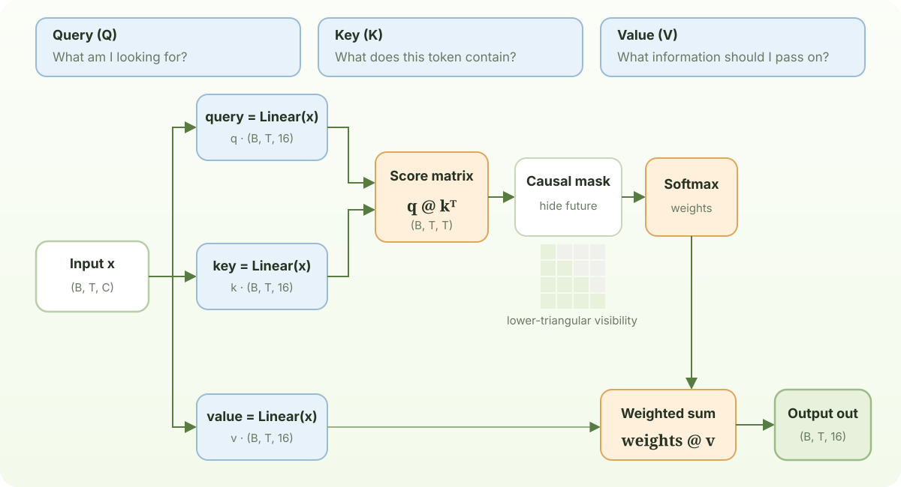

# Chapter 4: Self-Attention

Self-attention lets every token decide which earlier tokens are relevant. Each position produces a **query** (what am I looking for), a **key** (what do I contain), and a **value** (what information should I send).

## 1. Scaled dot-product attention

For queries `Q`, keys `K`, and values `V`, the core operation is:

$$
\operatorname{Attention}(Q,K,V)=\operatorname{softmax}\left(\frac{QK^T}{\sqrt{d_k}}\right)V
$$

The lower-triangular mask sets future affinities to negative infinity before softmax. The scale by `√d_k` keeps logits in a useful range at initialization.

```python
B,T,C = 2, 4, 6 # batch, time, channels
x = torch.randn(B,T,C)

head_size = 16
key = nn.Linear(C, head_size, bias=False)
query = nn.Linear(C, head_size, bias=False)
value = nn.Linear(C, head_size, bias=False)
k = key(x)   # (B, T, 16)
q = query(x) # (B, T, 16)
wei =  q @ k.transpose(-2, -1) # (B, T, 16) @ (B, 16, T) ---> (B, T, T)

tril = torch.tril(torch.ones(T, T))
wei = wei.masked_fill(tril == 0, float('-inf'))
wei = F.softmax(wei, dim=-1)
print("wei[0]=")
print(wei)

v = value(x)
out = wei @ v

print("out shape=")
print(out.shape)
```



Unlike the uniform weights in the previous section, these attention weights depend on the input. The trainable query and key projections determine each query–key score; Softmax turns those scores into a distribution over the visible context. During training, gradients from the prediction loss update the projections, allowing the model to learn which earlier positions are useful for each input. The weights are therefore computed dynamically, not stored as one fixed set of values. The causal mask still gives future positions exactly zero weight.

```text
wei=
tensor([[[1.0000, 0.0000, 0.0000, 0.0000],
         [0.8588, 0.1412, 0.0000, 0.0000],
         [0.5144, 0.2423, 0.2433, 0.0000],
         [0.0864, 0.6992, 0.1418, 0.0726]],

        [[1.0000, 0.0000, 0.0000, 0.0000],
         [0.4835, 0.5165, 0.0000, 0.0000],
         [0.2309, 0.3487, 0.4203, 0.0000],
         [0.1741, 0.2136, 0.2453, 0.3670]]], grad_fn=<SoftmaxBackward0>)
out shape=
torch.Size([2, 4, 16])
```
