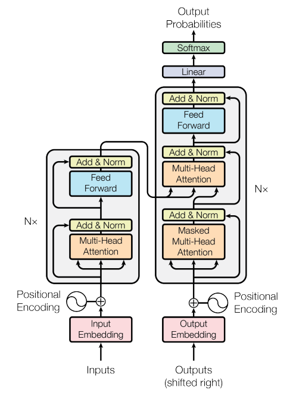

# Chapter 6: The Transformer Block

Attention moves information between positions. A feed-forward network transforms each position independently after that communication step.

## Communication plus computation

```python
x = x + self.sa(self.ln1(x))
x = x + self.ffwd(self.ln2(x))
```

The additions are residual connections: each sublayer learns an update to an existing representation instead of rebuilding it from zero. Layer normalization stabilizes the activations before each sublayer (the pre-norm arrangement).

The feed-forward network usually expands the channel dimension, applies a nonlinearity such as GELU, and projects back. Stacking blocks lets information and transformations accumulate over depth.

## Decoder-only structure

GPT uses causal self-attention in every block. Future positions are masked, so the same network can train on all positions in parallel while generation remains autoregressive.

## The original encoder-decoder Transformer

The first Transformer used an encoder stack on the input side and a decoder stack on the output side. GPT keeps the decoder-style, causally masked path, but omits the separate encoder stack.



> **Source:** Figure 1 from Vaswani et al., [“Attention Is All You Need”](https://arxiv.org/abs/1706.03762) (2017).

## Exercise

Implement one block with a single head, then replace it with multi-head attention. Track tensor shapes through each residual connection.
