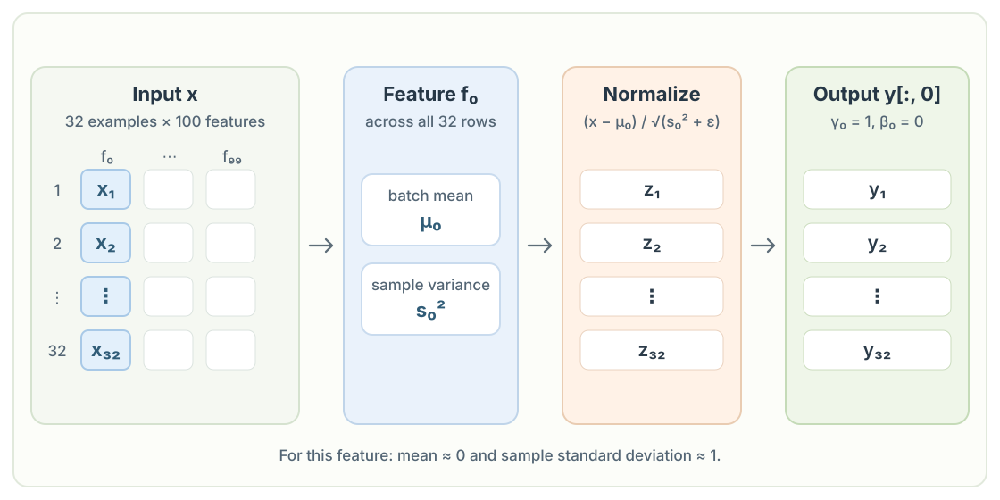

# Chapter 1: Batch Normalization

Batch normalization works **feature by feature across the examples in a batch**. Here `x` has shape `[32, 100]`, meaning 32 examples with 100 features each. The calls `x.mean(0, keepdim=True)` and `x.var(0, keepdim=True)` reduce the 32 rows and return statistics of shape `[1, 100]`. Each of the 100 feature columns has its own mean and variance, shared by all 32 examples in that column.



```python
import torch

class BatchNorm1d:
  
  def __init__(self, dim, eps=1e-5, momentum=0.1):
    self.eps = eps
    self.momentum = momentum
    self.training = True
    # affine scale and shift (fixed in this example)
    self.gamma = torch.ones(dim)
    self.beta = torch.zeros(dim)
    # buffers (trained with a running 'momentum update')
    self.running_mean = torch.zeros(dim)
    self.running_var = torch.ones(dim)
  
  def __call__(self, x):
    # calculate the forward pass
    if self.training:
      xmean = x.mean(0, keepdim=True) # batch mean
      xvar = x.var(0, keepdim=True) # batch variance
    else:
      xmean = self.running_mean
      xvar = self.running_var
    xhat = (x - xmean) / torch.sqrt(xvar + self.eps) # normalize to unit variance
    self.out = self.gamma * xhat + self.beta
    # update the buffers
    if self.training:
      with torch.no_grad():
        self.running_mean = (1 - self.momentum) * self.running_mean + self.momentum * xmean
        self.running_var = (1 - self.momentum) * self.running_var + self.momentum * xvar
    return self.out
  
  def parameters(self):
    return [self.gamma, self.beta]

torch.manual_seed(1337)
module = BatchNorm1d(100)
x = torch.randn(32, 100) # batch size 32 of 100-dimensional vectors
y = module(x)
print(y[:, 0].mean(), y[:, 0].std())
```

```text
tensor(7.4506e-09) tensor(1.0000)
```

For feature $j$, let $x_{ij}$ be its value in example $i$. The training branch computes a separate mean and sample variance down each column:

$$
\mu_j = \frac{1}{N}\sum_{i=1}^{N}x_{ij},
\qquad
s_j^2 = \frac{1}{N-1}\sum_{i=1}^{N}(x_{ij}-\mu_j)^2.
$$

In this example $N=32$, so the mean divides by 32 and the variance divides by 31. That $N-1$ denominator comes from `x.var(0)` using PyTorch's default `correction=1`. The built-in [`torch.nn.BatchNorm1d`](https://docs.pytorch.org/docs/2.14/generated/torch.nn.BatchNorm1d.html) instead uses `correction=0` for its training forward pass. The custom layer then normalizes each value and applies a feature-specific scale and shift:

$$
\hat{x}_{ij} = \frac{x_{ij}-\mu_j}{\sqrt{s_j^2+\varepsilon}},
\qquad
y_{ij} = \gamma_j\hat{x}_{ij}+\beta_j.
$$

Subtracting $\mu_j$ centers the column around zero. Dividing by its sample standard deviation gives it approximately unit sample standard deviation. The small $\varepsilon$ keeps the denominator stable when the variance is close to zero. In this snippet, $\gamma_j=1$ and $\beta_j=0$, so $y_{ij}=\hat{x}_{ij}$. They are plain tensors without `requires_grad=True`, which means they are **not trainable as written**, even though `parameters()` returns them. To learn the scale and shift, initialize those tensors with `requires_grad=True`.

The print statement inspects only the first feature, `y[:, 0]`. Its mean is essentially zero, and its sample standard deviation is about one. `torch.std()` uses the same sample-variance convention as `x.var(0)`, while $\varepsilon$ makes the result only approximately one.

During training, `running_mean` and `running_var` keep a moving estimate of each feature's statistics. With momentum $m=0.1$, each update follows

$$
\mu_j^{\mathrm{run}} \leftarrow (1-m)\mu_j^{\mathrm{run}}+m\mu_j,
\qquad
v_j^{\mathrm{run}} \leftarrow (1-m)v_j^{\mathrm{run}}+m s_j^2.
$$

When `training` is `False`, the layer uses these stored running statistics instead of statistics from the current batch. Unlike $\gamma$ and $\beta$, the running values are updated without backpropagation.
