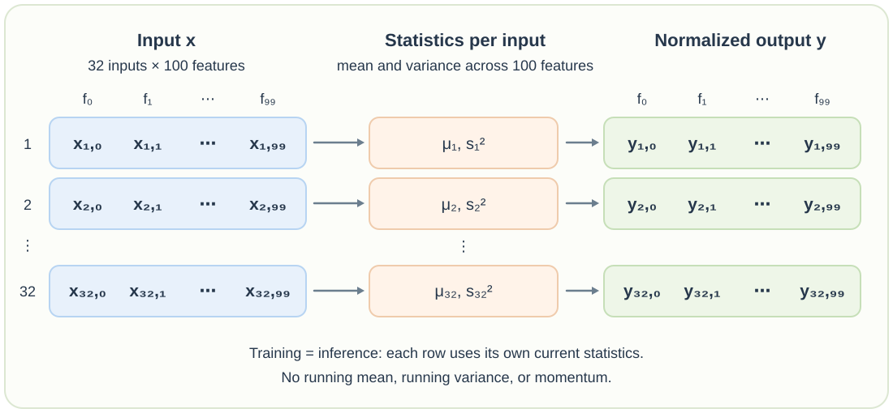

# Chapter 2: Layer Normalization

[Batch normalization](./chapter-1-batch-normalization.md) computes statistics **down a feature column**, using different examples in the batch. Layer normalization changes the direction: it computes statistics **across the features of one input**. If `x` has shape `[32, 100]`, each of its 32 rows gets its own mean and variance from its 100 features. One row does not need values from any other row to be normalized.



For input $i$ with $D$ features, the statistics and output are

$$
\mu_i = \frac{1}{D}\sum_{j=1}^{D}x_{ij},
\qquad
s_i^2 = \frac{1}{D-1}\sum_{j=1}^{D}(x_{ij}-\mu_i)^2,
$$

$$
\hat{x}_{ij} = \frac{x_{ij}-\mu_i}{\sqrt{s_i^2+\varepsilon}},
\qquad
y_{ij} = \gamma_j\hat{x}_{ij}+\beta_j.
$$

Here $D=100$. The mean and variance are different for each input $i$. The scale $\gamma_j$ and shift $\beta_j$ are shared across inputs for feature $j$. The small $\varepsilon$ keeps the division stable. Because this code calls `x.var(1)` without changing the default correction, it uses **sample variance** and divides by $D-1=99$. [PyTorch's built-in `nn.LayerNorm`](https://docs.pytorch.org/docs/2.14/generated/torch.nn.LayerNorm.html) uses `correction=0` instead, so its variance divides by $D=100$. The normalization direction is the same, but the two implementations will not produce identical values.

The custom implementation makes that direction explicit. `mean(1)` and `var(1)` reduce the feature dimension of each row, producing two `[32, 1]` tensors that broadcast back across the 100 features:

```python
import torch

class LayerNorm1d:

  def __init__(self, dim, eps=1e-5):
    self.eps = eps
    self.gamma = torch.ones(dim)
    self.beta = torch.zeros(dim)

  def __call__(self, x):
    # calculate the forward pass
    xmean = x.mean(1, keepdim=True)
    xvar = x.var(1, keepdim=True)
    xhat = (x - xmean) / torch.sqrt(xvar + self.eps) # normalize to unit variance
    self.out = self.gamma * xhat + self.beta
    return self.out

  def parameters(self):
    return [self.gamma, self.beta]

torch.manual_seed(1337)
module = LayerNorm1d(100)
x = torch.randn(32, 100) # batch size 32 of 100-dimensional vectors
y = module(x)
print(y[0, :].mean(), y[0, :].std())
```

```text
tensor(-9.5367e-09) tensor(1.0000)
```

The print statement checks one complete input, `y[0, :]`, rather than one feature across the batch. Its mean is effectively zero and its **sample standard deviation** is about one. The standard deviation is only approximately one because of $\varepsilon$. With `gamma` initialized to one and `beta` to zero, the output is just the normalized row. As written, those are plain tensors, so `parameters()` returns them but does not make them trainable. They would need `requires_grad=True` to learn a scale and shift.

There is no `self.training` branch in `LayerNorm1d`. **Training and inference use the same computation**, taking the mean and variance from the current input row. It does not keep `running_mean` or `running_var`, so it needs no `momentum` setting or moving-average update. This also means changing the other rows in the batch does not change a given row's normalized result. BatchNorm is different because it uses batch statistics during training and stored running statistics during inference.

This `LayerNorm1d` example handles a two-dimensional `[batch, features]` tensor. In a Transformer, activations usually have shape `[batch, sequence, embedding]`, or `[B, T, C]`. `nn.LayerNorm(C)` normalizes the `C` features **separately for every token in every example**. It does not average across the batch or across token positions.
