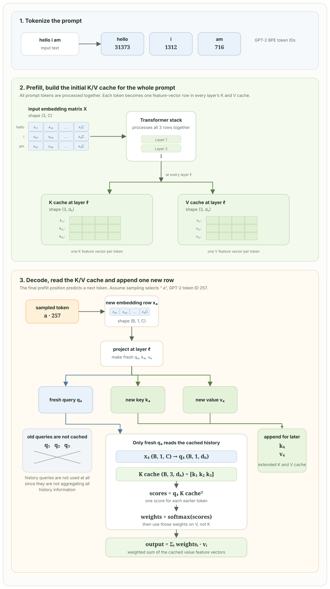

# Chapter 3: KV Cache

Before treating KV cache as a serving optimization, revisit the self-attention flow from [Part 1, Chapter 4](../part-1-transformer/chapter-4-self-attention.md). Every input token $x$ is projected three ways. Queries and keys produce a score matrix; after the causal mask and Softmax, those scores become weights; the weights select and combine values. KV cache follows directly from asking which outputs in this graph a **future** token still needs.

## 1. Read the cache directly from the attention flow

Focus on decoding the next token at position $t$. It makes a fresh $q_t$, $k_t$, and $v_t$. Its query is compared against the keys at every visible position, then the resulting weights combine the values at those same positions:

$$
\operatorname{Attention}(q_t, K_{\leq t}, V_{\leq t}) =
\operatorname{softmax}\left(\frac{q_tK_{\leq t}^{\mathsf T}}{\sqrt{d_h}}\right)V_{\leq t}.
$$

The key path answers **where should this new query look?** The value path answers **what information should it retrieve from each location?** So when the next query $q_{t+1}$ arrives, it still needs $k_t$ to score position $t$, and it still needs $v_t$ to read the content at position $t$. Under causal attention, later tokens never change an earlier token's K or V. They are exactly the persistent state worth saving:

$$
K_{\text{cache}}=[k_1, k_2, \ldots, k_{t-1}],
\qquad
V_{\text{cache}}=[v_1, v_2, \ldots, v_{t-1}].
$$

Past queries have a different role. $q_t$ creates only the row of the score matrix for position $t$ and therefore only the output for position $t$. Once that output has been passed to the next layer, no later attention computation reads $q_t$ again: $q_{t+1}$ creates its own scores against past **keys**, not past queries. Caching old Q would consume memory without changing any future output.

For the current step, append the newly made K and V to the stored history, use the new Q to read it, then keep only the expanded K/V cache for the next step:

$$
K_{\leq t}=[K_{\text{cache}}; k_t],
\qquad
V_{\leq t}=[V_{\text{cache}}; v_t].
$$

For a concrete cache read, let the processed prompt be `hello i am`, with three cached rows $k_1,k_2,k_3$ and $v_1,v_2,v_3$ at a given layer. During decode, only the newest token's hidden state enters the query projection. Its input has shape $(B, 1, C)$, not $(B, T, C)$, and it produces $q_4$ with shape $(B, 1, d_h)$. This fresh $q_4$ is the only query needed for the next attention row. It creates scores against the old keys, normalizes those scores, then uses the weights to combine the old values:

$$
\operatorname{softmax}\left(\frac{q_4K_{1:3}^{\mathsf T}}{\sqrt{d_h}}\right)V_{1:3}.
$$

The old queries $q_1,q_2,q_3$ do not appear in this expression. They already produced their own output rows during prefill. The current $k_4$ and $v_4$ are appended so that a later query can read them.

This state exists at **every Transformer layer**. A cache from layer 4 cannot be used by layer 5, because layer 5 receives a different representation of the token. The output from each layer becomes the input to the next layer, which maintains its own K/V history.

## 2. Two phases of a request: prefill and decode

Inference has two distinct phases. The example below follows the prompt `hello i am` through both of them.

### Prefill: process the prompt

In the figure, GPT-2 BPE maps `hello i am` to three token IDs. Their embeddings form a prompt matrix with three token rows. During **prefill**, the model runs all of those rows through every Transformer layer in parallel. At each layer $ell$, it writes one key feature vector and one value feature vector for every prompt token, producing K and V cache tensors with shape $(B, 3, d_h)$ for this example.

The causal mask still prevents a token from seeing later tokens, but the implementation can use efficient matrix operations over the full prompt. Each layer owns a separate cache because its input representation differs from the representations at all other layers.

The attention work of a full prompt grows roughly quadratically with prompt length because every query position compares with many key positions. This phase often has high arithmetic intensity and uses the GPU efficiently, especially when several requests are batched together.

### Decode: generate one token at a time

During **decode**, the model receives only the newest token. In the figure, the sampled token ` a` becomes one embedding row with shape $(B, 1, C)$. At layer $ell$, the query projection therefore produces only $q_4$ with shape $(B, 1, d_h)$, rather than queries for all earlier tokens.

This new query scores the cached keys, producing one score for each earlier token. Softmax turns those scores into weights, and the weights combine the cached values. The historical queries are not read again. The new $k_4$ and $v_4$ are appended to that layer's cache, changing its shape from $(B, 3, d_h)$ to $(B, 4, d_h)$ for the next decode step. For a cache length $T$, each new token's attention reads $T$ cached positions, so its attention cost grows roughly linearly with the current context length.

Without a cache, generating token $t$ would rerun the entire $t$-token prefix through every layer. The cache avoids recomputing the projections and intermediate work for the first $t-1$ tokens. It does **not** make attention constant-time: the new query must still compare with the context that it is allowed to read.

| Phase | Tokens processed per forward pass | Main job | Cache effect |
| --- | ---: | --- | --- |
| Prefill | Whole prompt | Build the initial cache | Write one K/V entry per prompt token and layer |
| Decode | Usually one new token | Produce the next token | Read prior K/V entries, then append one entry |

## 3. Cache layout and memory cost

For batch size $B$, $L$ layers, cache length $T$, $H_{kv}$ key/value heads, head dimension $d_h$, and $s$ bytes per element, the K/V cache requires approximately

$$
\text{bytes} = 2 \times B \times L \times T \times H_{kv} \times d_h \times s.
$$

The factor of two is for both keys and values. A common physical layout is conceptually `[layer, batch, kv_head, time, head_dim]`; real engines rearrange or page it to make appending and reading efficient. The exact layout matters to kernels, but the number of elements above does not.

For example, a 32-layer model with 32 KV heads of dimension 128, an 8,192-token context, batch size 1, and FP16 cache entries uses

$$
2 \times 1 \times 32 \times 8192 \times 32 \times 128 \times 2
= 4\ \text{GiB}.
$$

That is only the K/V cache. Model weights, activations for the current forward pass, temporary attention buffers, and runtime overhead need additional memory. As a result, long contexts and many simultaneous users can exhaust accelerator memory even when the model weights fit comfortably.

## 4. Why inference becomes memory-bound

At short contexts, the cost of model weights and matrix multiplications can dominate. At long contexts, every decode step must read a growing K/V cache. The new query performs relatively little math for each cached key/value vector it fetches, so decoding can become limited by memory bandwidth rather than floating-point throughput.

This explains an important serving behavior: adding users or increasing context length may reduce tokens per second even if the model's arithmetic units are not fully busy. The service needs enough cache capacity for all active sequences, and each active decode step reads a different amount of history.
