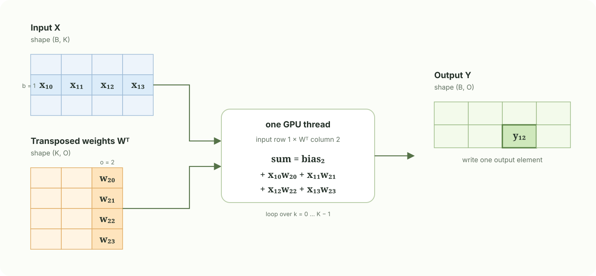
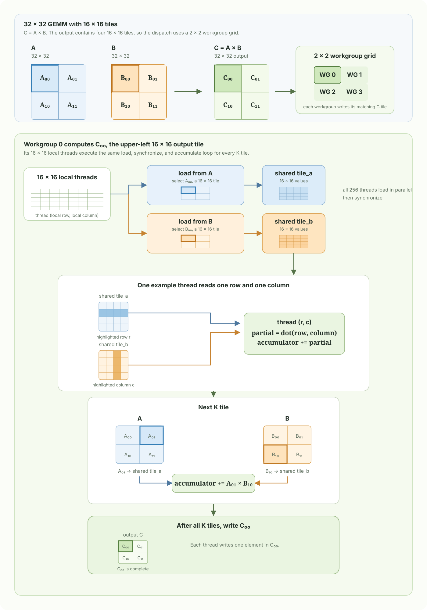

# Chapter 4: GEMM

GEMM means **general matrix multiplication**. A linear layer can be written as

$$
Y = XW^{\mathsf T} + b,
$$

where the input $X$ has shape $(B, K)$, the weight matrix $W$ has shape $(O, K)$, the bias $b$ has shape $(O)$, and the output $Y$ has shape $(B, O)$. Here $B$ is the batch size, $K$ is `input_size`, and $O$ is `output_size`.

For one output element, the computation is a dot product between one input row and one weight row:

$$
Y_{b,o}=b_o + \sum_{k=0}^{K-1} X_{b,k}W_{o,k}.
$$

## 1. One GPU thread computes one output element

A simple parallel implementation assigns one GPU thread to one output coordinate $(b,o)$. That thread reads input row $b$ and column $o$ of $W^{\mathsf T}$, walks through the full $K$ dimension, adds the bias for output $o$, then writes $Y_{b,o}$. When matrices are stored in flat buffers, their elements are addressed in row-major order.

This is simple and correct, but neighboring GPU threads repeatedly load the same input and weight values from global memory. For example, all output columns for one batch row need the same input row.

## 2. Tile-based GEMM reuses global-memory loads

A tiled GPU kernel views the linear layer as ordinary GEMM:

$$
\underbrace{Y}_{B \times O} =
\underbrace{X}_{B \times K}
\underbrace{W^{\mathsf T}}_{K \times O} + b.
$$

One $16 \times 16$ workgroup owns one $16 \times 16$ output tile. Its rows correspond to 16 batch positions, and its columns correspond to 16 output channels. Each GPU thread owns one accumulator for one output element in that tile. The workgroup then walks through the reduction dimension $K$ in chunks of 16.

For a concrete example, let $A$, $B$, and $C=AB$ all be $32 \times 32$, with tile size 16. The $32 \times 32$ output divides into a $2 \times 2$ grid of output tiles, so the kernel launches a $2 \times 2$ grid of workgroups. The figure follows Workgroup 0, which owns the upper-left output tile $C_{00}$. It has $16 \times 16 = 256$ threads, one for each element of that output tile.

For one K chunk, the threads cooperatively stage two tiles in shared memory:

$$
X_{\text{tile}} \in \mathbb{R}^{16 \times 16},
\qquad
W^{\mathsf T}_{\text{tile}} \in \mathbb{R}^{16 \times 16}.
$$

The input tile contains 16 batch rows and 16 K values. The transposed-weight tile contains the same 16 K values and 16 output columns. In the original weight storage, $W$ is shaped $(O,K)$, so the kernel writes the loaded values into shared memory in a transposed layout. This lets each thread multiply one row from `input_tile` by one column from `weight_tile` during the inner loop.

All threads must synchronize after loading their shared-memory values. Each thread then performs 16 multiply-accumulate operations from the two tiles. A second synchronization is required before the workgroup overwrites the shared tiles for the next K chunk. If a matrix dimension is not divisible by 16, out-of-range tile entries are filled with zero so the same inner loop remains valid.

For one $16 \times 16$ output tile and one K chunk of 16 values, the naive approach performs $16 \times 16 \times 16 \times 2 = 8192$ global reads. The tiled approach loads $16 \times 16$ input values and $16 \times 16$ weight values once, or 512 global reads, then reuses each loaded value across 16 multiply-accumulate operations. After all K tiles are processed, each thread adds the bias for its output column and writes one output value.

The tile size is a trade-off. Larger tiles increase reuse, but they also require more shared memory and more threads per workgroup. A $16 \times 16$ tile is a useful teaching example, while production kernels tune tile sizes, vectorized loads, register blocking, and hardware-specific matrix instructions for the target GPU.
