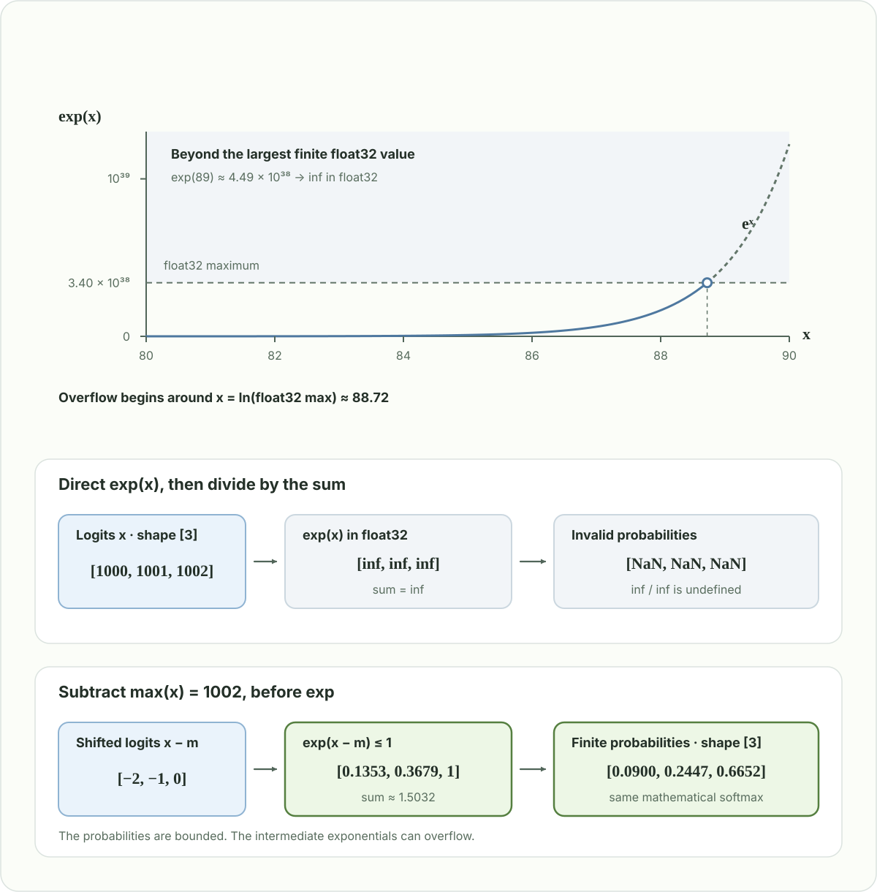

# Chapter 5: Online Softmax

Softmax converts a row of logits into probabilities. In attention, each query has a row of scores over the keys. In language-model sampling, each token position has a row of logits over the vocabulary. The normalization is independent for each row.

**Online softmax maintains a running maximum and a running normalization sum as values arrive.** Here “online” means processing a sequence incrementally. It does not refer to model training or serving requests over a network.

## 1. Start with numerically stable softmax

For a row $x \in \mathbb{R}^{N}$,

$$
p_i = \frac{e^{x_i}}{\sum_{j=1}^{N} e^{x_j}}.
$$

Directly computing $e^{x_i}$ can overflow for large positive logits. The largest finite float32 value is approximately $3.40 \times 10^{38}$, so $e^x$ exceeds that range when $x$ is above roughly $88.72$. This is a limit of the intermediate exponential, even though the final softmax probabilities are between zero and one.



For example, logits $[1000,1001,1002]$ are finite in float32, but their exponentials overflow to `inf`. Dividing those values by their sum gives `inf / inf`, which produces `NaN`. Subtracting the same constant from every logit leaves the probabilities unchanged. Choosing the row maximum gives

$$
m = \max_j x_j,
\qquad
\ell = \sum_{j=1}^{N} e^{x_j-m},
\qquad
p_i = \frac{e^{x_i-m}}{\ell}.
$$

Every exponent is now nonpositive, so each exponential is at most one. For finite logits, at least one term equals one and $1 \leq \ell \leq N$.

A straightforward implementation scans the row to find $m$, scans it again to calculate $\ell$, then scans it once more to write $p$. Can we calculate $m$ and $\ell$ together, even though a larger maximum might appear later?

## 2. Online softmax

**Algorithm 1: Online softmax normalizer**

**Input:** a nonempty row of finite logits $x_1,\ldots,x_N$.  
**Output:** the maximum $m$ and the exponential sum $\ell$ relative to $m$.

$$
\begin{array}{r l}
1 & m \gets -\infty,\quad \ell \gets 0 \\
2 & \mathbf{for}\ i = 1,\ldots,N\ \mathbf{do} \\
3 & \quad m' \gets m \\
4 & \quad m \gets \max(m, x_i) \\
5 & \quad \ell \gets \ell\,e^{m'-m} + e^{x_i-m} \\
6 & \mathbf{end\ for} \\
7 & \mathbf{return}\ (m,\ell)
\end{array}
$$

This algorithm calculates the maximum and normalizer in **one pass**. After each iteration, $m$ is the largest logit seen so far, and $\ell$ is the sum of the processed logits' exponentials with that current maximum subtracted. Only these two scalars persist between iterations. The recurrence follows [Online normalizer calculation for softmax](https://arxiv.org/abs/1805.02867).

Here $m'$ denotes the **old maximum**, saved before updating $m$. If the next logit introduces a larger maximum, the old exponential terms were calculated relative to $m'$ and must be converted to the new reference $m$. Each old term receives the same correction:

$$
e^{x_j-m} = e^{x_j-m'}\,e^{m'-m}.
$$

Because this factor is shared by every previous term, we can multiply their accumulated sum once instead of revisiting those logits:

$$
\underbrace{\sum_{j=1}^{i-1}e^{x_j-m}}_{\text{old terms at the new maximum}}
= \underbrace{\sum_{j=1}^{i-1}e^{x_j-m'}}_{\text{previous }\ell}\,e^{m'-m}.
$$

Then add the new term $e^{x_i-m}$. If the maximum is unchanged, $m'=m$ and the correction factor is one. If the maximum increases, $m'<m$ and the correction factor is less than one, shrinking the previous contributions. For the first finite logit, the initialization gives $m=x_1$ and $\ell=1$.

After the pass, the final state is

$$
m = \max_{1 \le j \le N} x_j,
\qquad
\ell = \sum_{j=1}^{N} e^{x_j-m}.
$$

To produce the complete probability row, use

$$
p_i = \frac{e^{x_i-m}}{\ell}.
$$

The **normalizer** takes one pass. Writing all probabilities still requires another pass over the logits, or retaining them until the final $(m,\ell)$ is known.

For a nonempty list of finite logits, the Python implementation follows the same updates:

```python
import math


def online_softmax(x):
    m, l = -math.inf, 0.0
    for value in x:
        old_m = m
        m = max(m, value)
        l = l * math.exp(old_m - m) + math.exp(value - m)
    return [math.exp(value - m) / l for value in x]


print(online_softmax([1000, 1001, 1002]))
# [0.09003057317038046, 0.24472847105479764, 0.6652409557748218]
```
